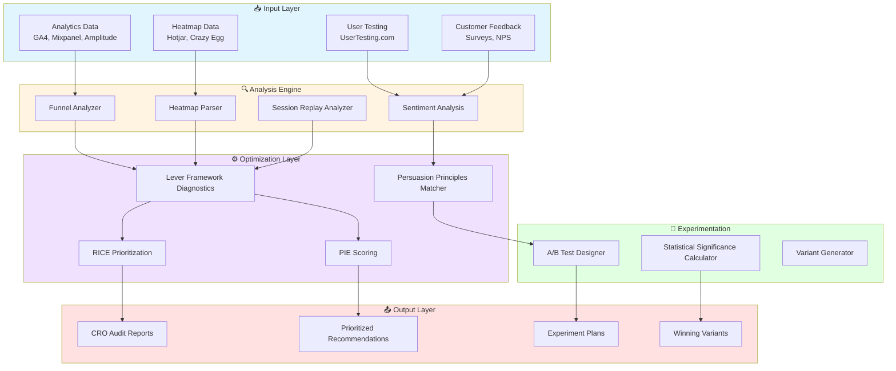
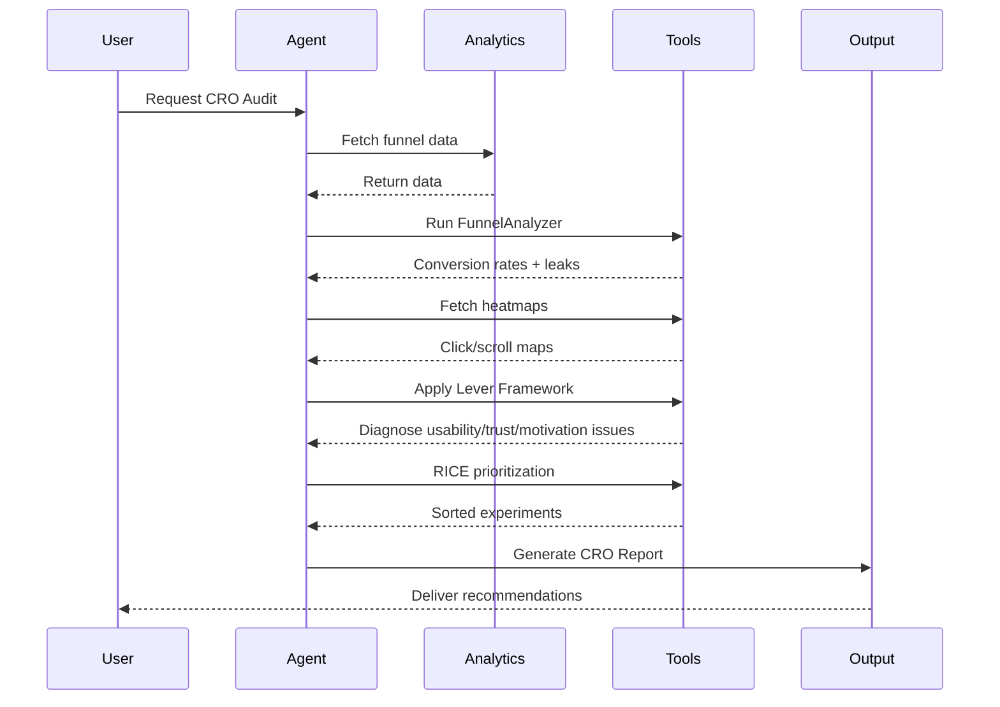

# Conversion Architect - Technical Architecture

**Version**: 1.0.0  
**Last Updated**: 2026-01-10

---

## System Design Overview

The Conversion Architect Agent operates as a **data analysis + experimentation engine**, combining behavioral analytics, psychological principles, and systematic testing to optimize conversion rates.



---

## Technical Stack

### Analytics Platforms

- **Google Analytics 4** (GA4): Traffic, conversion funnels, attribution
- **Mixpanel**: Event-based analytics, cohort analysis, funnels
- **Amplitude**: Behavioral analytics, user journeys
- **Heap**: Auto-capture analytics, retroactive event analysis

### Behavioral Analysis Tools

- **Hotjar**: Heatmaps, session recordings, surveys, funnels
- **Crazy Egg**: Click/scroll heatmaps, A/B testing, recordings
- **Microsoft Clarity**: Free heatmaps, rage click detection
- **Lucky Orange**: Real-time heatmaps, live chat, conversion funnels
- **Fullstory**: Digital experience intelligence, session replay

### A/B Testing & Experimentation

- **VWO (Visual Website Optimizer)**: Visual editor, multivariate testing, AI insights
- **Optimizely**: Enterprise experimentation platform, AI-driven (Opal)
- **Google Optimize** (deprecated 2023, alternatives: VWO, Optimizely)
- **Statsig**: Modern experimentation platform, feature flags
- **GrowthBook**: Open-source A/B testing, Bayesian statistics

### User Testing Platforms

- **UserTesting.com**: Remote moderated/unmoderated testing
- **TryMyUI**: Quick usability testing, 5-minute tests
- **Maze**: Rapid testing, prototype validation
- **Lookback**: Live user interviews, screen sharing

### Neuromarketing & Advanced Analytics

- **Eye-Tracking Software**: Tobii, MouseFlow (mouse tracking as proxy)
- **Emotion Analytics**: Affectiva, Realeyes (facial coding)
- **AI Personalization**: Dynamic Yield, Algonomy

---

## Component Architecture

### 1. Funnel Analyzer Module

**Language**: Python  
**Framework**: Pandas, NumPy, Matplotlib

**Core Functions**:

```python
# funnel_analyzer.py

import pandas as pd
import numpy as np
from typing import List, Dict, Tuple

class FunnelAnalyzer:
    def __init__(self, funnel_data: pd.DataFrame):
        self.data = funnel_data
        
    def calculate_conversion_rates(self) -> Dict[str, float]:
        """Calculate CR between each funnel stage"""
        stages = self.data['stage'].unique()
        conversion_rates = {}
        
        for i in range(len(stages) - 1):
            curr_stage = stages[i]
            next_stage = stages[i+1]
            
            curr_users = self.data[self.data['stage'] == curr_stage]['user_count'].sum()
            next_users = self.data[self.data['stage'] == next_stage]['user_count'].sum()
            
            cr = (next_users / curr_users) * 100 if curr_users > 0 else 0
            conversion_rates[f"{curr_stage} → {next_stage}"] = round(cr, 2)
            
        return conversion_rates
    
    def identify_leaks(self, threshold: float = 50.0) -> List[str]:
        """Find funnel stages with CR below threshold"""
        crs = self.calculate_conversion_rates()
        leaks = [stage for stage, cr in crs.items() if cr < threshold]
        return leaks
    
    def cohort_breakdown(self, segment_by: str) -> pd.DataFrame:
        """Segment funnel by traffic source, device, etc."""
        return self.data.groupby(['stage', segment_by])['user_count'].sum().unstack()
```

**Example Usage**:

```python
# Load funnel data
funnel_df = pd.read_csv('funnel_data.csv')
analyzer = FunnelAnalyzer(funnel_df)

# Get conversion rates
crs = analyzer.calculate_conversion_rates()
# Output: {'Homepage → Product': 35.0, 'Product → Cart': 30.0, ...}

# Find leaks
leaks = analyzer.identify_leaks(threshold=50)
# Output: ['Homepage → Product', 'Product → Cart']
```

---

### 2. A/B Test Statistical Engine

**Language**: TypeScript  
**Framework**: Node.js

```typescript
// ab_test_engine.ts

interface TestResults {
  variant: string;
  visitors: number;
  conversions: number;
  conversionRate: number;
}

interface SignificanceResult {
  pValue: number;
  isSignificant: boolean;
  confidenceLevel: number;
  winner: string | null;
  uplift: number;
}

class ABTestEngine {
  /**
   * Calculate statistical significance using two-proportion z-test
   */
  calculateSignificance(
    controlResults: TestResults,
    variantResults: TestResults,
    confidenceLevel: number = 0.95
  ): SignificanceResult {
    const pControl = controlResults.conversionRate / 100;
    const pVariant = variantResults.conversionRate / 100;
    
    const nControl = controlResults.visitors;
    const nVariant = variantResults.visitors;
    
    // Pooled proportion
    const pPool = (controlResults.conversions + variantResults.conversions) / 
                  (nControl + nVariant);
    
    // Standard error
    const se = Math.sqrt(pPool * (1 - pPool) * (1/nControl + 1/nVariant));
    
    // Z-score
    const z = (pVariant - pControl) / se;
    
    // P-value (two-tailed)
    const pValue = 2 * (1 - this.normalCDF(Math.abs(z)));
    
    // Is test significant?
    const alpha = 1 - confidenceLevel;
    const isSignificant = pValue < alpha;
    
    // Calculate uplift
    const uplift = ((pVariant - pControl) / pControl) * 100;
    
    return {
      pValue: parseFloat(pValue.toFixed(4)),
      isSignificant,
      confidenceLevel,
      winner: isSignificant ? (pVariant > pControl ? 'Variant' : 'Control') : null,
      uplift: parseFloat(uplift.toFixed(2))
    };
  }
  
  /**
   * Cumulative Distribution Function for standard normal distribution
   */
  private normalCDF(x: number): number {
    const t = 1 / (1 + 0.2316419 * Math.abs(x));
    const d = 0.3989423 * Math.exp(-x * x / 2);
    const prob = d * t * (0.3193815 + t * (-0.3565638 + t * (1.781478 + 
                    t * (-1.821256 + t * 1.330274))));
    return x > 0 ? 1 - prob : prob;
  }
  
  /**
   * Calculate required sample size for target power
   */
  calculateSampleSize(
    baselineConversion: number,
    minimumDetectableEffect: number,
    power: number = 0.8,
    alpha: number = 0.05
  ): number {
    const p1 = baselineConversion / 100;
    const mde = minimumDetectableEffect / 100;
    const p2 = p1 * (1 + mde);
    
    // Z-scores for alpha and beta
    const zAlpha = 1.96; // for 95% confidence (two-tailed)
    const zBeta = 0.84;  // for 80% power
    
    const n = ((zAlpha + zBeta) ** 2 * (p1 * (1 - p1) + p2 * (1 - p2))) / 
              ((p2 - p1) ** 2);
    
    return Math.ceil(n);
  }
}
```

**Example Usage**:

```typescript
const engine = new ABTestEngine();

const control = {
  variant: 'Control',
  visitors: 10000,
  conversions: 500,
  conversionRate: 5.0
};

const testVariant = {
  variant: 'New CTA',
  visitors: 10000,
  conversions: 580,
  conversionRate: 5.8
};

const result = engine.calculateSignificance(control, testVariant, 0.95);
// Output: { pValue: 0.0042, isSignificant: true, winner: 'Variant', uplift: 16.0 }
```

---

### 3. RICE Prioritization Engine

```python
# rice_prioritizer.py

from typing import List, Dict
from dataclasses import dataclass

@dataclass
class Hypothesis:
    name: str
    reach: int          # Users affected per quarter
    impact: float       # 0.25 (minimal) to 3 (massive)
    confidence: float   # 0.5 (50%) to 1.0 (100%)
    effort: float       # Person-months
    
class RICEPrioritizer:
    def calculate_rice_score(self, hypothesis: Hypothesis) -> float:
        """RICE = (Reach × Impact × Confidence) / Effort"""
        score = (hypothesis.reach * hypothesis.impact * hypothesis.confidence) / hypothesis.effort
        return round(score, 2)
    
    def prioritize(self, hypotheses: List[Hypothesis]) -> List[Dict]:
        """Return sorted list by RICE score (high to low)"""
        scored = []
        for h in hypotheses:
            rice_score = self.calculate_rice_score(h)
            scored.append({
                'hypothesis': h.name,
                'rice_score': rice_score,
                'reach': h.reach,
                'impact': h.impact,
                'confidence': h.confidence,
                'effort': h.effort
            })
        
        # Sort descending by RICE score
        scored.sort(key=lambda x: x['rice_score'], reverse=True)
        return scored
```

---

## Processing Pipeline

### CRO Audit Workflow



---

## Scalability & Performance

### Data Handling

- **Real-Time Analytics**: WebSocket connections to analytics platforms for live data
- **Batch Processing**: Nightly ETL jobs for historical funnel analysis
- **Caching**: Redis for frequently accessed funnel reports (1-hour TTL)

### API Rate Limits

- **Google Analytics 4**: 10 requests/second, 10,000/day
- **Mixpanel**: 60 requests/minute
- **Hot jar**: 100 requests/minute (Enterprise plan)

**Mitigation**: Queue system (Bull/BullMQ) for batching requests

---

## Security & Compliance

### Data Privacy

- **PII Masking**: All analytics scrub personal identifiers (names, emails, IPs)
- **GDPR Compliance**: Obtain consent, provide data export/deletion
- **Cookie Consent**: CCPA/ePrivacy compliant (opt-in before tracking)

### Secure Storage

- **Encryption**: AES-256 for data at rest
- **Access Control**: Role-based permissions (Admin, Analyst, Viewer)

---

## Platform-Specific Implementations

### Gemini (Google AI Studio / Vertex AI)

- **Multimodal Analysis**: Analyze heatmap screenshots, landing page mockups
- **Use Case**: "Analyze this heatmap and identify usability issues"
- **Long Context**: Ingest entire user test transcripts (100K+ tokens)

### Claude (Anthropic)

- **Statistical Analysis**: Process CSV exports from analytics platforms
- **Extended Thinking**: Deep funnel breakdowns with hypothesis generation
- **Use Case**: "Analyze this funnel data and recommend 3 experiments"

### ChatGPT (OpenAI)

- **GPT Actions**: Direct API integration with VWO, Hotjar, Google Analytics
- **Code Generation**: SQL queries for custom conversion reports
- **Use Case**: "Write a SQL query to find users who churned at checkout"

---

**Document Version**: 1.0.0  
**Last Updated**: 2026-01-10  
**Maintained By**: OpenOps Conversion Team
