# Growth Marketing & Growth Hacking Agent - Technical Architecture

**Version**: 1.0.0  
**Agent ID**: `growth-marketer`  
**Namespace**: `org.openops.agents.strategic.growth-marketer`

---

## 1. System Design Overview

### Architectural Principles

1. **Data-Driven Everything**: All decisions backed by statistically significant data
2. **Experimentation Velocity**: Ship tests fast, learn faster, iterate constantly
3. **Metric-Obsessed**: Track everything, optimize ruthlessly
4. **Viral by Design**: Build growth loops into every feature
5. **Retention First**: Focus on keeping users before acquiring more

### Component Architecture

```mermaid
graph TD
    A[Growth Marketing Agent] --> B[Analytics Engine]
    A --> C[Experimentation Platform]
    A --> D[Funnel Optimization Module]
    A --> E[Viral Loop Designer]
    A --> F[Retention Automation Engine]
    
    B --> B1[Mixpanel Integration]
    B --> B2[Amplitude Integration]
    B --> B3[Google Analytics 4]
    B --> B4[Custom Event Tracking]
    
    C --> C1[A/B Test Manager]
    C --> C2[Feature Flag Controller]
    C --> C3[Statistical Analysis]
    C --> C4[Winner Declaration]
    
    D --> D1[AARRR Funnel Tracker]
    D --> D2[Conversion Optimizer]
    D --> D3[Cohort Analyzer]
    D --> D4[Attribution Modeler]
    
    E --> E1[Referral Program Engine]
    E --> E2[Viral Coefficient Calculator]
    E --> E3[Share Mechanics Designer]
    E --> E4[Incentive Optimizer]
    
    F --> F1[Email Automation]
    F --> F2[Push Notification Scheduler]
    F --> F3[In-App Messaging]
    F --> F4[Churn Prediction ML]
```



---

## 2. Technical Stack

### Analytics & Data Infrastructure

#### Product Analytics Platforms

- **Mixpanel**: Event-based analytics, funnel analysis, retention cohorts, A/B test tracking
- **Amplitude**: Behavioral analytics, user journey mapping, predictive cohorts, Experiment (built-in A/B testing)
- **Heap**: Auto-capture all events, retroactive analysis, session replay
- **Google Analytics 4 (GA4)**: Web traffic, acquisition channels, conversion tracking
- **Segment**: Customer Data Platform (CDP) - single SDK, route events to all tools

#### Data Warehousing & SQL

- **BigQuery / Snowflake / Redshift**: Central data warehouse for all product, marketing, and sales data
- **dbt (Data Build Tool)**: Transform raw data into analytics-ready models
- **Looker / Tableau / Mode**: BI dashboards for stakeholders

#### Real-Time Event Streaming

- **Kafka / Kinesis**: Real-time event stream processing
- **Firehose**: Stream events to S3, Redshift, or external tools
- **Airbyte / Fivetran**: Automated data pipeline connectors

### Experimentation & A/B Testing Tools

#### Web & Mobile Testing

- **VWO (Visual Website Optimizer)**: Visual editor, A/B tests, multivariate tests, heatmaps
- **Optimizely**: Enterprise-grade experimentation, feature flags, personalization
- **AB Tasty**: Client-side + server-side tests, AI-powered recommendations
- **Google Optimize (Sunset)**: Migrated to GA4 experiments

#### Product & Feature Flag Platforms

- **LaunchDarkly**: Feature flags, progressive rollouts, kill switches
- **Split.io**: Feature delivery + experimentation platform
- **Statsig**: Built for engineering teams, warehouse-native, statistical rigor
- **GrowthBook**: Open-source, developer-friendly, Bayesian stats

#### Revenue-Attribution Testing

- **PIMMS**: Connect test results directly to sales data (critical for B2B SaaS)

### Marketing Automation & CRM

#### Email Marketing Automation

- **Customer.io**: Behavioral email campaigns, segmentation, A/B testing
- **Braze**: Multi-channel (email, push, SMS, in-app), journey orchestration
- **Klaviyo**: E-commerce focused, deep Shopify integration
- **Iterable**: Cross-channel campaigns, workflow builder

#### CRM & Sales Automation

- **HubSpot**: All-in-one CRM, marketing automation, lead scoring
- **Salesforce Pardot**: B2B marketing automation
- **ActiveCampaign**: SMB-focused automation

#### Referral Program Software

- **ReferralCandy**: E-commerce referral programs, Shopify integration
- **Friendbuy**: Referral + loyalty programs, enterprise-grade
- **Yotpo**: Reviews + referrals + loyalty (unified platform)
- **Viral Loops**: Pre-built referral templates, gamification

### User Engagement & Retention

#### In-App Messaging & Onboarding

- **Appcues**: Product tours, tooltips, onboarding flows (no-code)
- **Pendo**: Product analytics + in-app guidance + feedback
- **Intercom**: Chatbots, knowledge base, targeted messages
- **Chameleon**: Product tours, tooltips, surveys

#### Push Notifications

- **OneSignal**: Multi-platform push (web, mobile, email)
- **Airship**: Enterprise push notification platform
- **Firebase Cloud Messaging (FCM)**: Google's push service
- **Apple Push Notification Service (APNS)**: iOS push

### AI & Machine Learning for Growth

#### Churn Prediction & LTV Modeling

- **ProfitWell**: Subscription analytics, churn prediction, pricing intelligence
- **ChartMogul**: SaaS metrics, cohort analysis, MRR tracking
- **Baremetrics**: SaaS analytics, forecasting, recover failed payments

#### Personalization Engines

- **Dynamic Yield**: AI-powered personalization (web, mobile, email)
- **Monetate**: E-commerce personalization, A/B testing
- **Algolia Recommend**: AI product recommendations

---

## 3. Processing Pipeline

### Input Handling

#### Accepted Input Types

1. **Product Usage Data** (Events from Segment/Mixpanel/Amplitude)
   - User actions: sign-ups, feature usage, purchases
   - Event properties: user_id, timestamp, event_name, properties
2. **Marketing Campaign Data** (UTM parameters, ad platforms)
   - Google Ads, Facebook Ads, LinkedIn Ads API data
   - Email campaign metrics (opens, clicks, conversions)
3. **Revenue Data** (Stripe, Chargebee, Recurly)
   - Subscriptions, MRR, churn, expansion revenue
4. **Customer Feedback** (NPS surveys, support tickets)
   - Sentiment analysis, feature requests, pain points

#### Input Validation & Normalization

```typescript
interface GrowthDataInput {
  type: 'event' | 'campaign' | 'revenue' | 'feedback';
  source: 'mixpanel' | 'ga4' | 'stripe' | 'intercom' | 'custom';
  timestamp: Date;
  user_id: string;
  anonymous_id?: string;
  properties: Record<string, any>;
}

function validateGrowthData(input: GrowthDataInput): ValidationResult {
  // 1. Schema validation
  // 2. Data type enforcement
  // 3. Required fields check
  // 4. Timestamp format validation
  // 5. User ID de-duplication
  return { valid: true, normalized_data: input };
}
```

### Core Processing Logic

#### AARRR Funnel Analysis Engine

```python
class AAARRFunnelAnalyzer:
    """
    Automated AARRR funnel tracking and optimization
    """
    def analyze_funnel(self, start_date, end_date, cohort=None):
        # 1. Acquisition: Traffic sources, conversion rates
        acquisition = self.get_acquisition_metrics(start_date, end_date, cohort)
        
        # 2. Activation: Onboarding completion, time-to-value
        activation = self.get_activation_metrics(start_date, end_date, cohort)
        
        # 3. Retention: Day 1/7/30/90 retention cohorts
        retention = self.get_retention_cohorts(start_date, end_date, cohort)
        
        # 4. Revenue: ARPU, LTV, expansion revenue
        revenue = self.get_revenue_metrics(start_date, end_date, cohort)
        
        # 5. Referral: Viral coefficient, referral conversion
        referral = self.get_referral_metrics(start_date, end_date, cohort)
        
        # Calculate conversion rates between stages
        funnel_conversion = {
            'acquisition_to_activation': activation['users'] / acquisition['users'],
            'activation_to_retention': retention['day_30_retention'] * activation['users'],
            'retention_to_revenue': revenue['paying_users'] / retention['active_users'],
            'revenue_to_referral': referral['referrers'] / revenue['paying_users']
        }
        
        # Identify bottlenecks
        bottlenecks = self.identify_bottlenecks(funnel_conversion)
        
        return AAARRFunnelReport(
            acquisition, activation, retention, revenue, referral,
            funnel_conversion, bottlenecks
        )
```

#### Experimentation Statistical Engine

```typescript
class ExperimentAnalyzer {
  /**
   * Rigorous statistical analysis for A/B tests
   */
  analyzeExperiment(experimentId: string): ExperimentResult {
    const experiment = this.getExperiment(experimentId);
    const control = experiment.variants.find(v => v.name === 'control');
    const treatment = experiment.variants.find(v => v.name === 'treatment');
    
    // 1. Sample size validation
    const sampleSizeCheck = this.validateSampleSize(control, treatment);
    if (!sampleSizeCheck.sufficient) {
      return { status: 'insufficient_data', message: 'Need more samples' };
    }
    
    // 2. Calculate conversion rates
    const controlRate = control.conversions / control.visitors;
    const treatmentRate = treatment.conversions / treatment.visitors;
    const lift = (treatmentRate - controlRate) / controlRate;
    
    // 3. Statistical significance (two-sample z-test)
    const zScore = this.calculateZScore(control, treatment);
    const pValue = this.getPValue(zScore);
    const significant = pValue < 0.05;
    
    // 4. Confidence intervals
    const confidenceInterval = this.calculateConfidenceInterval(
      treatmentRate, treatment.visitors, 0.95
    );
    
    // 5. Winner declaration
    const winner = significant && lift > 0 ? 'treatment' : 
                   significant && lift < 0 ? 'control' : 'no_winner';
    
    return {
      experiment_id: experimentId,
      control_rate: controlRate,
      treatment_rate: treatmentRate,
      lift: lift,
      p_value: pValue,
      statistically_significant: significant,
      confidence_interval: confidenceInterval,
      winner: winner,
      recommendation: this.generateRecommendation(winner, lift, pValue)
    };
  }
  
  calculateZScore(control, treatment): number {
    const p1 = control.conversions / control.visitors;
    const p2 = treatment.conversions / treatment.visitors;
    const p_pooled = (control.conversions + treatment.conversions) / 
                     (control.visitors + treatment.visitors);
    
    const se = Math.sqrt(p_pooled * (1 - p_pooled) * 
                         (1/control.visitors + 1/treatment.visitors));
    
    return (p2 - p1) / se;
  }
}
```

#### Viral Coefficient Calculator

```python
class ViralLoopAnalyzer:
    """
    Calculate and optimize viral coefficient (K-factor)
    """
    def calculate_viral_coefficient(self, users_data):
        # K = (invites sent per user) × (conversion rate of invites)
        
        total_users = len(users_data)
        total_invites_sent = sum(u['invites_sent'] for u in users_data)
        total_invites_converted = sum(u['invites_converted'] for u in users_data)
        
        avg_invites_per_user = total_invites_sent / total_users
        invite_conversion_rate = total_invites_converted / total_invites_sent if total_invites_sent > 0 else 0
        
        k_factor = avg_invites_per_user * invite_conversion_rate
        
        # Calculate viral cycle time (how long to complete one loop)
        avg_time_to_convert_referral = self.calculate_avg_referral_time(users_data)
        
        # Project viral growth
        projected_growth = self.project_viral_growth(
            initial_users=total_users,
            k_factor=k_factor,
            cycle_time=avg_time_to_convert_referral,
            time_horizon_days=90
        )
        
        # Optimization recommendations
        recommendations = []
        if k_factor < 1:
            if avg_invites_per_user < 2:
                recommendations.append("Increase invite prompts and incentives")
            if invite_conversion_rate < 0.15:
                recommendations.append("Improve referral landing page and sign-up flow")
        
        return ViralCoefficient Report(
            k_factor=k_factor,
            avg_invites_per_user=avg_invites_per_user,
            invite_conversion_rate=invite_conversion_rate,
            viral_cycle_time=avg_time_to_convert_referral,
            projected_growth=projected_growth,
            recommendations=recommendations
        )
```

### Output Generation

#### Growth Strategy Report

```markdown
# Growth Strategy Report - [Company Name]
**Period**: [Date Range]  
**Generated**: [Timestamp]

## Executive Summary
- **North Star Metric**: [Metric] = [Value] ([+/-]% vs. last period)
- **Key Wins**: [Top 3 improvements]
- **Critical Issues**: [Top 3 bottlenecks]

## AARRR Funnel Analysis

### Acquisition
- **Traffic**: [Total visitors] ([+/-]% MoM)
- **Top Channels**: Organic ([%]), Paid ([%]), Referral ([%]), Direct ([%])
- **CAC**: $[Amount] ([+/-]% vs. target)

### Activation
- **Activation Rate**: [%] ([+/-]% vs. last period)
- **Time to Value**: [X minutes] (Target: < 5 min)
- **Onboarding Drop-Off**: Step 2 ([%] drop) ← **Bottleneck**

### Retention
- **Day 1 Retention**: [%]
- **Day 7 Retention**: [%]
- **Day 30 Retention**: [%] ← **Below target**
- **Monthly Churn**: [%]

### Revenue
- **ARPU**: $[Amount]
- **LTV**: $[Amount]
- **LTV:CAC Ratio**: [X]:1 (Target: > 3:1)
- **NRR**: [%] (Target: > 100%)

### Referral
- **Viral Coefficient (K)**: [Value] (Target: > 1)
- **NPS**: [Score] (Target: ≥ 50)
- **Referral Conversion**: [%]

## Active Experiments
| Test ID | Hypothesis | Status | Winner | Lift |
|---------|------------|--------|--------|------|
| EXP-123 | New onboarding flow | Running | TBD | - |
| EXP-124 | Pricing page CTA | Complete | Treatment | +15% |

## Recommendations (Prioritized)
1. **[HIGH]** Fix onboarding Step 2 drop-off (38% abandonment)
2. **[HIGH]** Improve Day 30 retention (currently 42%, target 55%)
3. **[MEDIUM]** Scale winning experiment EXP-124 to 100%
```

---

## 4. Scalability Considerations

### Performance Optimization

- **Event Batching**: Batch analytics events (send every 10 seconds vs. real-time)
- **Data Sampling**: For massive datasets, sample statistically significant subset
- **Query Caching**: Cache funnel reports for 1 hour, cohort data for 24 hours
- **Async Processing**: Run heavy computations (LTV models, churn predictions) asynchronously

### Resource Management

```yaml
resource_limits:
  analytics_queries:
    concurrent_queries: 10
    query_timeout_seconds: 30
    result_cache_ttl_hours: 1
  
  ab_testing:
    max_active_tests: 20
    min_sample_size_per_variant: 1000
    max_test_duration_days: 30
  
  automation:
    email_send_rate_limit: "10,000/hour"
    push_notification_limit: "50,000/hour"
```

### Horizontal Scaling

- **Microservices Architecture**: Separate services for analytics, experimentation, automation
- **Load Balancing**: Distribute analytics queries across read replicas
- **CDN for Static Assets**: Landing pages, marketing sites served via CDN

---

## 5. Security & Compliance

### Data Protection

- **PII Encryption**: All personally identifiable information encrypted at rest (AES-256)
- **Access Control**: Role-based access (RBAC) for analytics dashboards
- **Anonymization**: Option to anonymize user data for privacy compliance
- **Data Retention**: Configurable retention policies (GDPR: 30 days to 2 years)

### Marketing Compliance

- **CAN-SPAM**: Unsubscribe links in all emails, honor opt-outs within 10 days
- **GDPR**: Explicit consent for email marketing, right to data deletion
- **CCPA**: California privacy law compliance (opt-out of data sales)
- **NDMO (Saudi Arabia)**: Data localization, cross-border transfer approvals

### Audit Logging

```json
{
  "timestamp": "2026-01-10T12:50:00Z",
  "event_type": "experiment_launched",
  "actor": "growth-lead@example.com",
  "action": "create_ab_test",
  "resource": "experiment-456",
  "details": {
    "test_name": "New Pricing Page",
    "variants": ["control", "treatment_v1"],
    "traffic_allocation": "50/50"
  },
  "impact": "affects_10000_users_per_day"
}
```

---

## 6. Continuous Improvement

### Feedback Loops

1. **Experiment Results → Product Roadmap**: Winning tests inform feature prioritization
2. **Churn Analysis → Customer Success**: High-risk users flagged for proactive outreach
3. **Referral Data → Marketing Creative**: Top-performing referral copy → ad campaigns

### Learning Mechanisms

- **Bayesian Optimization**: ML models learn optimal test variants over time
- **Multi-Armed Bandit**: Dynamically allocate traffic to winning variants during test
- **Predictive Modeling**: Continuously retrain LTV, churn prediction models with new data

---

## Platform-Specific Architecture

### Gemini Implementation

```typescript
const geminiGrowthConfig = {
  model: 'gemini-2.0-flash-exp',
  context_length: 1_000_000, // 1M tokens for deep funnel analysis
  tools: [
    'analyze_dashboard_screenshot', // Multimodal: read charts/graphs
    'execute_sql_query', // Query analytics database
    'generate_growth_strategy_doc'
  ],
  use_cases: [
    'Comprehensive funnel analysis across 12 months',
    'Visual analysis of Mixpanel/Amplitude dashboards',
    'Generate detailed growth playbooks'
  ]
};
```

### Claude Implementation

```typescript
const claudeGrowthConfig = {
  model: 'claude-sonnet-4',
  extended_thinking: true,
  thinking_budget_tokens: 15000,
  use_cases: [
    'Statistical rigor for A/B test analysis',
    'Deep-dive cohort behavior analysis',
    'Hypothesis generation for experiments',
    'Churn root cause analysis'
  ]
};
```

### ChatGPT Implementation

```typescript
const chatGPTGrowthConfig = {
  model: 'gpt-4o',
  gpt_actions: [
    {
      name: 'query_mixpanel',
      endpoint: 'https://mixpanel.com/api',
      auth: 'Bearer <MIXPANEL_API_KEY>'
    },
    {
      name: 'trigger_email_campaign',
      endpoint: 'https://api.customer.io/v1/campaigns',
      auth: 'Bearer <CUSTOMERIO_API_KEY>'
    },
    {
      name: 'create_ab_test',
      endpoint: 'https://api.vwo.com/v1/experiments',
      auth: 'Basic <VWO_CREDENTIALS>'
    }
  ],
  use_cases: [
    'Live Mixpanel query execution',
    'Automated campaign launches',
    'Real-time A/B test creation and monitoring'
  ]
};
```

---

## Disaster Recovery & Business Continuity

### Backup Strategy

- **Analytics Data**: Daily snapshots to S3, 90-day retention
- **Experiment Configs**: Version-controlled in Git, deployed via CI/CD
- **User Segments**: Backed up hourly to prevent audience loss

### Failover Mechanisms

- **Analytics Platform Outage**: Fallback to secondary analytics tool (Amplitude → Mixpanel)
- **A/B Test Platform Failure**: Feature flag system allows manual variant assignment
- **Email Provider Downtime**: Multi-provider setup (Customer.io → SendGrid backup)

---

## Metrics & Monitoring

### System Health Metrics

- **Event Processing Latency**: P95 < 2 seconds
- **Dashboard Load Time**: P95 < 3 seconds
- **Experiment Analysis Accuracy**: Mismatch rate < 1%

### Business Impact Metrics

- **Experimentation Velocity**: Target 20 tests/quarter
- **Test Win Rate**: Target 20% (1 in 5 tests shows significant improvement)
- **Compound Growth Rate**: Monthly user growth % (organic + viral)

---

**Document Version**: 1.0.0  
**Last Updated**: 2026-01-10  
**Maintained By**: OpenOps Growth Engineering Team
