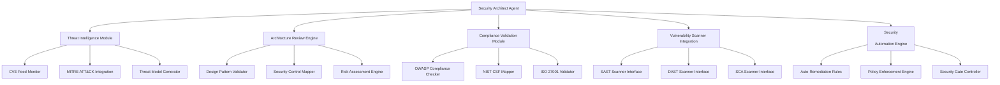

# Security Architect Agent - Technical Architecture

**Version**: 1.0.0  
**Agent ID**: `security-architect`  
**Namespace**: `org.openops.agents.engineering.security-architect`

---

## 1. System Design Overview

### Architectural Principles

1. **Security by Design**: Security controls embedded from initial architecture phase
2. **Defense in Depth**: Multiple overlapping layers of security controls
3. **Least Privilege**: Minimum necessary permissions for all components
4. **Fail Secure**: System defaults to deny-all posture on failure
5. **Zero Trust**: Continuous verification, never implicit trust

### Component Architecture



---

## 2. Technical Stack

### Core Technologies

#### Security Analysis & Scanning

- **SAST (Static Application Security Testing)**:
  - SonarQube, Checkmarx, Fortify, Semgrep
  - CodeQL (GitHub Advanced Security)
  
- **DAST (Dynamic Application Security Testing)**:
  - OWASP ZAP, Burp Suite Professional
  - Acunetix, Qualys Web App Scanning
  
- **SCA (Software Composition Analysis)**:
  - Snyk, Dependabot, WhiteSource
  - OWASP Dependency-Check

- **Container Security**:
  - Trivy, Clair, Anchore
  - Docker Bench for Security

#### Security Frameworks & Standards

- OWASP SAMM (Software Assurance Maturity Model)
- NIST SP 800-53 Control Library
- CIS Benchmarks automation tools
- MITRE ATT&CK Navigator

#### Infrastructure Security

- **Cloud Security Posture Management (CSPM)**:
  - Prisma Cloud, Wiz, Orca Security
  
- **Web Application Firewalls (WAF)**:
  - AWS WAF, Cloudflare, ModSecurity
  
- **API Gateways**:
  - Kong, Apigee, AWS API Gateway (with security plugins)

#### AI-Specific Security Tools

- Lakera Guard (LLM security)
- HiddenLayer AISec (ML model protection)
- Robust Intelligence (Cisco)
- CalypsoAI Moderator

### Integration Platforms

- **SIEM/SOAR**: Splunk, Elastic Security, Azure Sentinel
- **CI/CD Security**: Jenkins Security plugins, GitLab Security Dashboard
- **Secrets Management**: HashiCorp Vault, AWS Secrets Manager, Azure Key Vault

---

## 3. Processing Pipeline

### Input Handling

#### Accepted Input Types

1. **Architecture Diagrams** (`image/*, application/pdf, .drawio, .mermaid`)
2. **Infrastructure as Code** (`.tf, .yaml, .json` - Terraform, CloudFormation, Kubernetes)
3. **Application Code** (all major languages for security review)
4. **Security Requirements Documents** (`.md, .pdf, .docx`)
5. **Threat Models** (STRIDE, PASTA, LINDDUN formats)
6. **Vulnerability Reports** (SARIF, JSON, XML from scanners)

#### Input Validation

```typescript
interface SecurityInput {
  type: 'architecture' | 'code' | 'infrastructure' | 'policy' | 'threat_model';
  format: string;
  source: 'trusted' | 'untrusted';
  classification: 'public' | 'internal' | 'confidential' | 'restricted';
}

function validateSecurityInput(input: SecurityInput): ValidationResult {
  // 1. Format validation
  // 2. Size limits enforcement
  // 3. Malware scanning
  // 4. Classification verification
  // 5. Source authentication
}
```

### Core Processing Logic

#### Threat Modeling Engine

```python
class ThreatModelingEngine:
    """
    Automated threat modeling using STRIDE methodology
    """
    def analyze_architecture(self, design_doc):
        # 1. Identify assets and data flows
        assets = self.extract_assets(design_doc)
        data_flows = self.map_data_flows(design_doc)
        
        # 2. Identify trust boundaries
        trust_boundaries = self.identify_boundaries(design_doc)
        
        # 3. Apply STRIDE to each component
        threats = []
        for component in design_doc.components:
            threats.extend(self.apply_stride(component))
        
        # 4. Risk assessment
        for threat in threats:
            threat.risk = self.calculate_risk(threat)
        
        # 5. Control recommendations
        controls = self.recommend_controls(threats)
        
        return ThreatModel(assets, data_flows, threats, controls)
    
    def apply_stride(self, component):
        """
        STRIDE: Spoofing, Tampering, Repudiation, Information Disclosure,
                Denial of Service, Elevation of Privilege
        """
        return [
            self.check_spoofing(component),
            self.check_tampering(component),
            self.check_repudiation(component),
            self.check_info_disclosure(component),
            self.check_dos(component),
            self.check_privilege_escalation(component)
        ]
```

#### Security Control Mapper

```typescript
class SecurityControlMapper {
  /**
   * Maps threats to NIST SP 800-53 controls
   */
  mapToNISTControls(threat: Threat): Control[] {
    const controls: Control[] = [];
    
    // Access Control (AC)
    if (threat.category === 'authentication' || threat.category === 'authorization') {
      controls.push(...this.getACControls(threat));
    }
    
    // System and Communications Protection (SC)
    if (threat.category === 'network' || threat.category === 'encryption') {
      controls.push(...this.getSCControls(threat));
    }
    
    // Incident Response (IR)
    if (threat.likelihood === 'high' || threat.impact === 'critical') {
      controls.push(...this.getIRControls(threat));
    }
    
    return this.prioritize(controls);
  }
  
  /**
   * Maps controls to implementation tasks
   */
  generateImplementationPlan(controls: Control[]): Task[] {
    return controls.map(control => ({
      id: control.id,
      title: `Implement ${control.family}-${control.number}`,
      description: control.description,
      priority: this.calculatePriority(control),
      dependencies: this.findDependencies(control),
      estimated_effort: this.estimateEffort(control)
    }));
  }
}
```

### Output Generation

#### Security Architecture Document

```markdown
# Security Architecture - [Project Name]

## Executive Summary
- Overall security posture: [Rating]
- Critical risks identified: [Count]
- Recommended controls: [Count]

## Architecture Overview
[Generated architecture diagram with trust boundaries]

## Threat Model
### Identified Threats
| ID | Threat | STRIDE | Likelihood | Impact | Risk Score |
|----|--------|--------|------------|--------|------------|
| T-001 | [Description] | S | High | Critical | 9.5 |

### Recommended Controls
| Control ID | NIST Ref | Description | Priority | Effort |
|------------|----------|-------------|----------|--------|
| C-001 | AC-2 | Implement RBAC | High | Medium |

## Implementation Roadmap
- Phase 1 (Critical): [Timeline]
- Phase 2 (High): [Timeline]
- Phase 3 (Medium): [Timeline]
```

---

## 4. Scalability Considerations

### Performance Optimization

- **Parallel Processing**: Threat analysis parallelized across components
- **Caching Strategy**:
  - Threat model templates cached for 7 days
  - Control mappings cached for 30 days
  - CVE data refreshed daily
- **Incremental Analysis**: Only analyze changed components in incremental builds

### Resource Management

```yaml
resource_limits:
  cpu:
    threat_modeling: "4 cores max"
    vulnerability_scanning: "8 cores max"
  memory:
    architecture_analysis: "8GB max"
    compliance_validation: "4GB max"
  concurrency:
    max_parallel_scans: 5
    queue_size: 100
```

### Horizontal Scaling

- Stateless design allows multiple agent instances
- Load balancer distributes security reviews across instances
- Shared threat intelligence cache via Redis

---

## 5. Security & Compliance

### Data Protection Measures

#### Encryption

- **At Rest**: AES-256 for threat models, architecture diagrams
- **In Transit**: TLS 1.3 minimum for all API communications
- **Key Management**: Rotation every 90 days, stored in HSM/KMS

#### Access Control

```typescript
enum SecurityArchitectRole {
  VIEWER = 'view_threats',
  ANALYST = 'view_threats,run_analysis',
  ARCHITECT = 'view_threats,run_analysis,approve_architecture',
  ADMIN = 'view_threats,run_analysis,approve_architecture,manage_policies'
}

class AccessControlPolicy {
  enforceRBAC(user: User, action: string): boolean {
    const requiredPermissions = this.getRequiredPermissions(action);
    return user.hasAllPermissions(requiredPermissions);
  }
}
```

### Audit Logging

#### Security Events Logged

- All architecture reviews (with before/after states)
- Threat model generation requests
- Control approval/rejection decisions
- Policy enforcement actions
- Security scan results

#### Log Format (SIEM-compatible)

```json
{
  "timestamp": "2026-01-10T12:30:45Z",
  "event_type": "security_architecture_review",
  "actor": "user@example.com",
  "action": "approve_architecture",
  "resource": "project-x/architecture-v2",
  "outcome": "success",
  "risk_level": "medium",
  "controls_added": 15,
  "threats_identified": 8,
  "session_id": "uuid"
}
```

### Compliance Automation

- Automated NIST CSF gap analysis
- ISO 27001:2022 control mapping
- OWASP ASVS level validation
- GDPR/NDMO privacy impact assessment trigger

---

## 6. Continuous Improvement

### Feedback Loops

1. **Vulnerability Detection → Threat Model Update**: New CVEs trigger threat model refresh
2. **Penetration Test Results → Control Enhancement**: Failed pentests update control library
3. **Incident Response → Architecture Hardening**: Security incidents inform design improvements

### Learning Mechanisms

- Machine learning model for risk scoring calibration
- Historical data analysis for false positive reduction
- Community threat intelligence integration (MITRE, OWASP)

### Version Control

- All threat models version-controlled (Git)
- Architecture decisions recorded as ADRs (Architecture Decision Records)
- Control library maintained with change tracking

---

## Platform-Specific Architecture

### Gemini Implementation

```typescript
// Leverage Gemini's long context for comprehensive architecture review
const geminiConfig = {
  model: 'gemini-2.0-flash-exp',
  max_tokens: 8192,
  temperature: 0.2, // Low for consistent security analysis
  tools: [
    'execute_code', // For security script execution
    'read_file', // For architecture diagram analysis
  ]
};
```

### Claude Implementation

```typescript
// Use Claude's extended thinking for complex threat modeling
const claudeConfig = {
  model: 'claude-sonnet-4',
  thinking: {
    type: 'enabled',
    budget_tokens: 10000
  },
  system_prompt_sections: [
    'security_frameworks',
    'threat_modeling_methodology',
    'compliance_requirements'
  ]
};
```

### ChatGPT Implementation

```typescript
// GPT Actions for security tool integration
const gptActions = [
  {
    name: 'scan_vulnerabilities',
    endpoint: 'https://api.snyk.io/v1/scan',
    auth: 'Bearer <SNYK_TOKEN>'
  },
  {
    name: 'check_compliance',
    endpoint: 'https://compliance-api.internal/nist',
    auth: 'Internal-Token <TOKEN>'
  }
];
```

---

## Disaster Recovery & Business Continuity

### Backup Strategy

- **Configuration**: Backed up daily to S3/GCS with 30-day retention
- **Threat Models**: Versioned in Git, replicated across 3 regions
- **Audit Logs**: Immutable storage with 7-year retention

### Failover Mechanisms

- Primary region failure → Automatic failover to secondary region (RTO: 15 minutes)
- Agent instance failure → Load balancer redirects to healthy instance (RTO: 30 seconds)
- Data corruption detection → Rollback to last known good state (RPO: 1 hour)

---

## Metrics & Monitoring

### Technical Metrics

- **Availability**: 99.95% uptime SLA
- **Response Time**: P95 < 500ms for threat analysis
- **Throughput**: 100 architecture reviews per hour
- **Error Rate**: < 0.1% for security scans

### Operational Metrics

- **Scan Coverage**: % of codebase covered by SAST/DAST
- **Control Effectiveness**: % of threats mitigated by implemented controls
- **Compliance Score**: Aggregate score across all frameworks
- **Attack Surface**: Tracked weekly, trending downward

---

## Integration SDK Examples

### Python SDK

```python
from openops.agents import SecurityArchitect

agent = SecurityArchitect(
    api_key=os.getenv('OPENOPS_API_KEY'),
    region='us-east-1'
)

# Run architecture review
result = agent.review_architecture(
    design_file='architecture.drawio',
    compliance_frameworks=['NIST-CSF', 'OWASP-TOP10'],
    risk_appetite='conservative'
)

print(f"Threats found: {result.threat_count}")
print(f"Risk score: {result.aggregate_risk_score}")
```

### REST API

```http
POST /api/v1/security-architect/review
Authorization: Bearer <token>
Content-Type: application/json

{
  "architecture_url": "s3://bucket/architecture.pdf",
  "frameworks": ["ISO-27001", "NIST-800-53"],
  "auto_remediate": false,
  "notification_webhook": "https://app.example.com/security-webhook"
}
```

---

**Document Version**: 1.0.0  
**Last Updated**: 2026-01-10  
**Maintained By**: OpenOps Security Team
