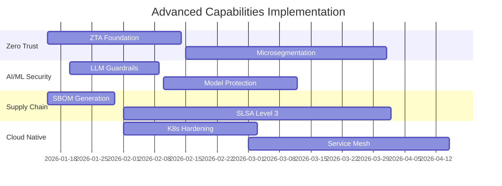

# Security Architect - Advanced Capabilities

**Version**: 1.0.0  
**Last Updated**: 2026-01-10

---

## Overview

Advanced capabilities extend the core security architecture functions with specialized, cutting-edge security practices required for modern, complex, and AI-driven systems.

---

## 1. Zero Trust Architecture Design {#zero-trust}

### Description

Design and implementation of Zero Trust security model based on "never trust, always verify" principles, eliminating implicit trust and enforcing continuous verification.

### Core Principles

1. **Verify Explicitly**: Always authenticate and authorize based on all available data points
2. **Use Least Privilege Access**: Limit user access with Just-In-Time (JIT) and Just-Enough-Access (JEA)
3. **Assume Breach**: Minimize blast radius, segment access, verify end-to-end encryption

### Architecture Components

#### Identity & Access Management

- **Multi-Factor Authentication (MFA)**: Required for all users, services, and devices
- **Risk-Based Authentication**: Adaptive authentication based on context
- **Privileged Access Management (PAM)**: Elevated permissions with time-limited access
- **Service-to-Service Authentication**: mTLS, workload identity, service mesh

#### Device Trust

- **Device Posture Assessment**: Health checks before granting access
- **Endpoint Detection & Response (EDR)**: Continuous monitoring
- **Certificate-Based Device Authentication**: Hardware-backed credentials
- **Mobile Device Management (MDM)**: Policy enforcement on mobile devices

#### Network Segmentation

- **Microsegmentation**: Granular network isolation per workload
- **Software-Defined Perimeter (SDP)**: Dynamic, identity-based perimeter
- **Zero Trust Network Access (ZTNA)**: Replace VPN with identity-aware access
- **East-West Traffic Control**: Internal traffic inspection and policy enforcement

#### Continuous Verification

- **Real-Time Risk Scoring**: Dynamic trust calculation per request
- **Behavioral Analytics**: Anomaly detection in user/service behavior
- **Session Monitoring**: Continuous authentication throughout session
- **Contextual Access Policies**: Location, device, time, risk-based rules

### Implementation Framework

```yaml
zero_trust_maturity_model:
  level_1_traditional:
    - Static perimeter
    - VPN for remote access
    - Basic firewalls
  
  level_2_advanced:
    - Network segmentation
    - MFA enabled
    - Basic monitoring
  
  level_3_optimal:
    - Microsegmentation
    - Identity-based access
    - Continuous verification
    - Encrypted everything
  
  level_4_transformational:
    - Fully automated ZTA
    - AI-driven risk assessment
    - Self-healing security
    - Predictive threat prevention
```

### Tools & Technologies

- **Identity Platforms**: Okta, Azure AD, Auth0, Keycloak
- **Service Mesh**: Istio, Linkerd, Consul
- **ZTNA Solutions**: Zscaler, Cloudflare Access, Palo Alto Prisma Access
- **Microsegmentation**: VMware NSX, Illumio, Guardicore

### Metrics

- **Zero Standing Privileges**: 100% JIT access for admin operations
- **Encryption Coverage**: 100% of data in transit and at rest
- **Authentication Success Rate**: > 99.9% with < 0.1% false positives
- **Microsegmentation Coverage**: 100% of production workloads

---

## 2. AI/ML System Security {#ai-ml-security}

### Description

Specialized security controls for protecting AI/ML systems, including LLMs, training pipelines, model serving infrastructure, and AI agent ecosystems.

### Threat Landscape

#### Model-Level Threats

- **Adversarial Attacks**: Crafted inputs designed to fool models
- **Model Inversion**: Extracting training data from model outputs
- **Model Extraction**: Stealing model architecture/weights via API queries
- **Backdoor Attacks**: Trojans embedded during training

#### Data-Level Threats

- **Data Poisoning**: Corrupting training data to manipulate model behavior
- **Label Flipping**: Changing labels in training sets
- **Dataset Inference**: Inferring if specific data was in training set
- **PII Leakage**: Unintentional exposure of personal data in outputs

#### Deployment-Level Threats

- **Prompt Injection**: Manipulating LLM behavior via crafted prompts
- **Jailbreaking**: Bypassing safety guardrails
- **API Abuse**: Excessive querying for model extraction
- **Supply Chain Compromise**: Malicious models from untrusted sources

### Security Controls

#### Input Validation & Sanitization

```python
class LLMInputValidator:
    """
    Multi-layer input validation for LLMs
    """
    def validate_prompt(self, prompt: str) -> ValidationResult:
        # 1. Length check
        if len(prompt) > self.max_length:
            return ValidationResult.reject("Prompt too long")
        
        # 2. Injection pattern detection
        if self.detect_injection_patterns(prompt):
            return ValidationResult.reject("Potential prompt injection detected")
        
        # 3. PII detection
        if self.contains_pii(prompt):
            return ValidationResult.sanitize("PII detected, redacting")
        
        # 4. Toxicity check
        if self.toxicity_score(prompt) > threshold:
            return ValidationResult.reject("Toxic content detected")
        
        return ValidationResult.allow()
```

#### Output Filtering & Guardrails

- **Content Filtering**: Block harmful, toxic, or inappropriate outputs
- **PII Redaction**: Automatically remove personal information from responses
- **Factuality Checking**: Verify outputs against knowledge base
- **Bias Detection**: Monitor for discriminatory or biased responses

#### Model Protection

- **Model Watermarking**: Embed signatures in model weights
- **Access Control**: RBAC for model access, rate limiting per user
- **Model Versioning**: Track provenance and integrity
- **Differential Privacy**: Add noise during training to protect training data

#### Monitoring & Auditing

- **Prompt/Response Logging**: Full audit trail (with privacy controls)
- **Anomaly Detection**: Unusual query patterns or outputs
- **Model Drift Monitoring**: Track performance degradation
- **Adversarial Input Detection**: Real-time identification of attacks

### AI Security Tools

- **Lakera Guard**: LLM security platform for prompt injection defense
- **HiddenLayer**: ML model protection and monitoring
- **Robust Intelligence (Cisco)**: AI security validation
- **CalypsoAI Moderator**: Enterprise LLM governance
- **Nvidia NeMo Guardrails**: Open-source LLM safety toolkit
- **Meta Llama Guard**: Content safety classifier

### AI Security Frameworks

- **NIST AI Risk Management Framework (AI RMF)**
- **ISO/IEC 42001**: AI Management System
- **OWASP Top 10 for LLMs**
- **MITRE ATLAS**: Adversarial Threat Landscape for AI Systems

### Compliance

- **EU AI Act**: Risk-based regulation of AI systems
- **Data Protection**: GDPR/NDMO compliance for AI processing
- **Model Cards**: Transparency documentation for AI models
- **Bias Auditing**: Regular fairness assessments

---

## 3. Software Supply Chain Security {#supply-chain}

### Description

Comprehensive security controls for the entire software supply chain, from code dependencies to build pipelines to deployment artifacts.

### OWASP Top 10 2025 Focus

**Software Supply Chain Failures** is a NEW category in OWASP Top 10 2025, reflecting increased attacks on dependencies and build processes.

### Threat Vectors

- **Malicious Dependencies**: Intentionally harmful packages (typosquatting, dependency confusion)
- **Compromised Maintainers**: Legitimate packages taken over by attackers
- **Build System Compromise**: CI/CD pipeline manipulation
- **Artifact Tampering**: Modified binaries during distribution
- **Insider Threats**: Malicious code from internal developers

### Security Controls

#### Software Bill of Materials (SBOM)

```json
{
  "bomFormat": "CycloneDX",
  "specVersion": "1.5",
  "version": 1,
  "metadata": {
    "timestamp": "2026-01-10T12:00:00Z",
    "component": {
      "name": "my-application",
      "version": "2.0.0"
    }
  },
  "components": [
    {
      "type": "library",
      "name": "express",
      "version": "4.18.2",
      "purl": "pkg:npm/express@4.18.2",
      "hashes": [{
        "alg": "SHA-256",
        "content": "abc123..."
      }]
    }
  ]
}
```

#### Dependency Management

- **Dependency Scanning**: Snyk, Dependabot, WhiteSource
- **License Compliance**: Ensure acceptable licenses (FOSSA, Black Duck)
- **Version Pinning**: Lock file enforcement, no wildcard versions
- **Private Registry**: Internal mirror for vetted packages
- **Update Policy**: Automated updates for security patches

#### Build Pipeline Security

- **Signed Commits**: GPG-signed commits required
- **Build Provenance**: SLSA (Supply chain Levels for Software Artifacts) compliance
- **Immutable Build Artifacts**: Content-addressable storage
- **Build Environment Isolation**: Containerized, ephemeral build agents
- **Secrets Management**: No secrets in code, use secret management tools

#### Artifact Integrity

- **Code Signing**: Sign all release artifacts
- **Checksum Verification**: SHA-256 hashes for all downloads
- **Transparency Logs**: Sigstore/Rekor for public audit trail
- **Container Image Scanning**: Trivy, Clair, Anchore
- **Image Signing**: Cosign for container signature verification

### SLSA Framework

```yaml
slsa_levels:
  level_1:
    - Document build process
    - Provenance available
  
  level_2:
    - Version control for source
    - Hosted build platform
    - Provenance authenticated
  
  level_3:
    - Source and build platform hardened
    - Provenance unforgeable
    - Hermetic builds
  
  level_4:
    - Two-party review
    - Hermetic, reproducible builds
    - All dependencies recursively verified
```

### Tools & Platforms

- **Dependency Scanning**: Snyk, Dependabot, Renovate
- **SBOM Generation**: Syft, CycloneDX, SPDX tools
- **Signing**: Sigstore, Cosign, GPG
- **Build Security**: GitHub Actions security, GitLab CI security scanning
- **Artifact Registry**: Artifactory, Nexus with security policies

### Metrics

- **SBOM Coverage**: 100% of production deployments
- **Dependency Freshness**: < 30 days old for non-frozen deps
- **Vulnerability Window**: < 48 hours from disclosure to patch
- **SLSA Level**: Target Level 3 for critical systems

---

## 4. Cloud-Native Security

### Description

Security architecture patterns and controls specifically designed for cloud-native applications, microservices, containers, and serverless functions.

### Container Security

#### Image Security

- **Base Image Vetting**: Minimal, distroless images preferred
- **Layer Scanning**: Scan all layers for vulnerabilities
- **Secret Detection**: No hardcoded credentials in images
- **Runtime Policies**: Enforce immutable, read-only containers

#### Runtime Protection

- **Container Isolation**: Namespace isolation, seccomp, AppArmor/SELinux
- **Resource Limits**: CPU, memory, network quotas
- **Network Policies**: Deny-all default, explicit allow rules
- **Runtime Threat Detection**: Falco, Aqua, Sysdig

### Kubernetes Security

#### Cluster Hardening

- **CIS Kubernetes Benchmark**: Automated compliance scanning
- **RBAC**: Least privilege for service accounts
- **Pod Security Standards**: Enforce restricted/baseline policies
- **Network Policies**: Microsegmentation at pod level
- **Secrets Management**: External secrets operator (Vault, AWS Secrets Manager)

#### Service Mesh Security

- **Mutual TLS**: Automatic encryption between services
- **Authorization Policies**: Fine-grained access control
- **Traffic Management**: Circuit breaking, rate limiting
- **Observability**: Distributed tracing, metrics

### Serverless Security

- **Function Permissions**: Least privilege IAM roles
- **Input Validation**: Strict validation at function entry
- **Secrets**: Environment variables from secret managers
- **Logging**: Comprehensive CloudWatch/Cloud Logging
- **Cold Start Protection**: Mitigate timing attacks

### Cloud Security Posture Management (CSPM)

- **Automated Compliance**: CIS benchmarks for AWS/Azure/GCP
- **Misconfiguration Detection**: Public S3 buckets, open security groups
- **Identity & Access Review**: Excessive permissions detection
- **Drift Detection**: Infrastructure changes from baseline

---

## 5. API Security Excellence

### Description

Advanced API security patterns aligned with OWASP API Security Top 10 2025.

### OWASP API Top 10 2025

1. **Broken Object Level Authorization (BOLA)**
2. **Broken Authentication**
3. **Broken Object Property Level Authorization**
4. **Unrestricted Resource Consumption**
5. **Broken Function Level Authorization**
6. **Unrestricted Access to Sensitive Business Flows**
7. **Server-Side Request Forgery (SSRF)**
8. **Security Misconfiguration**
9. **Improper Inventory Management**
10. **Unsafe Consumption of APIs**

### Security Controls

#### Authentication & Authorization

- **OAuth 2.1**: Modern auth standard (PKCE required)
- **OpenID Connect**: Identity layer on OAuth
- **JWT Best Practices**: Short expiry, signature validation, no sensitive data
- **API Keys**: Secondary auth, rate limiting per key
- **Scope-Based Access**: Granular permissions per endpoint

#### Rate Limiting & Throttling

```yaml
rate_limit_tiers:
  free:
    requests_per_minute: 60
    burst: 10
  premium:
    requests_per_minute: 600
    burst: 100
  enterprise:
    requests_per_minute: 6000
    burst: 1000
    custom_limits: true
```

#### Input Validation

- **Schema Validation**: OpenAPI/JSON Schema enforcement
- **Type Checking**: Strict data type validation
- **Length Limits**: Prevent DoS via large payloads
- **Character Whitelisting**: Block unexpected characters
- **SQL Injection Prevention**: Parameterized queries only

#### Output Security

- **Data Minimization**: Return only necessary fields
- **PII Filtering**: Automatic redaction of sensitive data
- **Error Handling**: Generic errors to external users, detailed logs internally
- **Response Headers**: Security headers (CORS, CSP, X-Frame-Options)

### API Gateway Security

- **Centralized Authentication**: All APIs behind gateway
- **Request/Response Transformation**: Normalize, sanitize
- **Threat Protection**: WAF integration, DDoS mitigation
- **Analytics**: Usage patterns, anomaly detection

---

## 6. Privacy Engineering

### Description

Privacy-by-design principles and technical controls to protect user privacy in compliance with GDPR, NDMO, and other regulations.

### Privacy Principles

- **Data Minimization**: Collect only necessary data
- **Purpose Limitation**: Use data only for stated purposes
- **Storage Limitation**: Delete data when no longer needed
- **Accuracy**: Ensure data correctness
- **Integrity & Confidentiality**: Protect against unauthorized access

### Privacy-Enhancing Technologies (PETs)

#### Encryption & Anonymization

- **End-to-End Encryption (E2EE)**: Data encrypted client-side
- **Homomorphic Encryption**: Compute on encrypted data
- **K-Anonymity**: Ensure data cannot identify individuals
- **Differential Privacy**: Add noise to protect individual data points

#### Data Protection

- **Pseudonymization**: Replace identifiers with pseudonyms
- **Tokenization**: Replace sensitive data with tokens
- **Data Masking**: Obfuscate data in non-production environments
- **Right to Erasure**: Automated data deletion workflows

#### Privacy by Design

- **Privacy Impact Assessments (PIA)**: Mandatory for new systems
- **Data Flow Mapping**: Visual representation of data movement
- **Consent Management**: Granular, auditable consent tracking
- **Data Subject Rights**: Automated handling of access, deletion requests

### Compliance Automation

- **GDPR Compliance Scanner**: Automated checks
- **Data Residency Enforcement**: Geo-fencing for data storage
- **Breach Notification**: Automated 72-hour notification workflow
- **Audit Trail**: Immutable logs of data access and modifications

---

## Advanced Capability Roadmap



---

**Document Owner**: Security Architect Agent Team  
**Review Frequency**: Monthly  
**Next Review Date**: 2026-02-10
