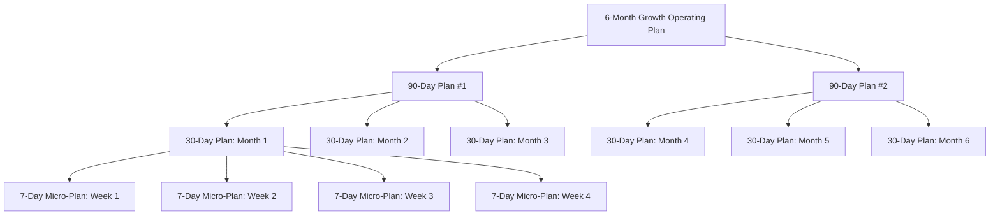
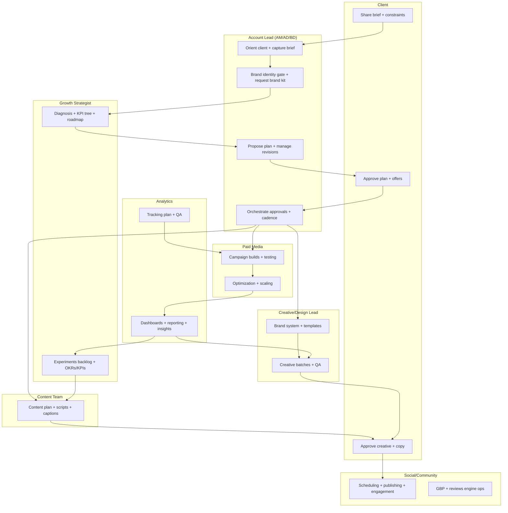
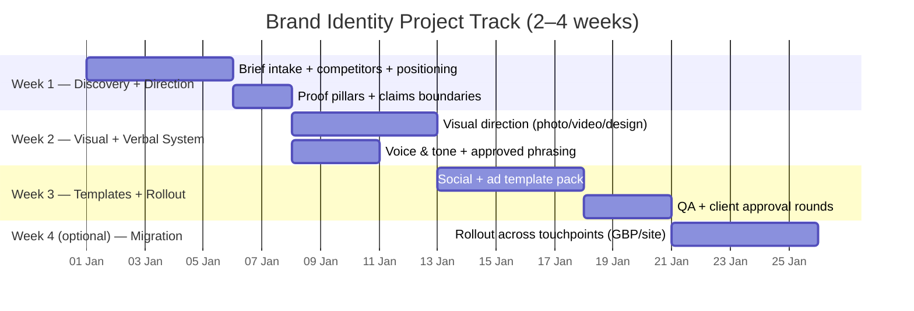

# 360° Digital Marketing Agency Workflow (Restaurant / Clinic / Café)

**Audience:** Business owners + agency teams (strategy, media buying, creative, social, CRM, analytics).  
**Scope:** End-to-end (“brief → strategy → execution → optimization → reporting → retention/offboarding”).  
**Positioning:** This is an **operating system**, not a “services list”. It defines who does what, when, with what artifacts, and how decisions are made.

### Related OpenOps References (Optional, for teams using this repo)
This workflow is compatible with the system’s “Impossible Level” operating mode (rapid validation + explicit surfaces + kill metrics) and maps cleanly to workflows in `11_marketing_growth_agent/06_workflows/master_workflows.json`.

Useful companion artifacts in this repo:
- Strategy + planning templates: `11_marketing_growth_agent/09_templates/ready_to_use_templates.md`
- Machine-readable journey (for automation/orchestration): `11_marketing_growth_agent/06_workflows/agency_live_journey.v1.json`
- Campaign briefs (system template): `11_marketing_growth_agent/11_marketing_growth_system/templates/campaign_brief.template.md`
- Content calendar (system template): `11_marketing_growth_agent/11_marketing_growth_system/templates/content_calendar.template.json`
- Lifecycle/CRM: `11_marketing_growth_agent/01_knowledge_base/lifecycle_crm_playbooks.md`
- Experimentation mindset: `11_marketing_growth_agent/01_knowledge_base/causal_inference_and_experimentation.md`
- MMM / budgeting: `11_marketing_growth_agent/01_knowledge_base/advanced_attribution_and_mmm.md`

Note: `11_marketing_growth_agent/README.md` lists additional templates (e.g., email sequence, landing page copy). In this repo snapshot, many of those are consolidated into `11_marketing_growth_agent/09_templates/ready_to_use_templates.md` or live under `11_marketing_growth_agent/11_marketing_growth_system/templates/`.

---

## 1) The Engagement Model (What “360°” Actually Means)

### 1.1 Definition of 360° Marketing (in operational terms)
“360°” is not “being on every channel”. It means:
- **One unified growth strategy** that maps business objectives → customer journey → channel mix.
- **One measurement system** (events, conversions, attribution philosophy, dashboards).
- **One execution cadence** (weekly operating rhythm + 7–14 day experiments).
- **One creative supply chain** (brief → concept → production → QA → launch → learnings).
- **One governance layer** (SLA, approvals, compliance, escalation rules).

### 1.2 Typical Retainers (choose one)
- **Foundation + Growth (recommended):** Setup, then steady-state growth loops.
- **Performance-Heavy:** Paid media-first, high iteration, strict attribution.
- **Content/Brand-Heavy:** Organic-first, creative systems, slower payoff.
- **Hybrid:** Balanced paid + organic + CRM.

### 1.3 “Single Source of Truth” (SSOT)
Pick one hub where every decision and artifact lives:
- **Notion / ClickUp / Asana** for tasks & docs
- **Drive** for assets
- **Slack/WhatsApp** for comms (but never as the “truth”)

**Rule:** If it’s not in SSOT, it didn’t happen.

### 1.4 Standard Roles (Agency-side) and Responsibilities
This workflow assumes a “pods” model: a stable cross-functional mini-team per client.

**Core roles (recommended minimum):**
- **Account Lead / Account Director:** Owns relationship, scope, approvals, expectations, escalation.
- **Growth Strategist:** Owns strategy doc, KPI tree, experiment backlog, learning narrative.
- **Media Buyer:** Owns paid campaigns, budget allocation, audience strategy, creative testing loops.
- **Creative Lead:** Owns creative system, briefs, concepts, production QA.
- **Content + Community:** Owns organic calendar, publishing, engagement, review workflows.
- **Analytics Lead:** Owns measurement plan, dashboards, data quality checks, attribution logic.
- **Lifecycle/CRM Lead (if available):** Owns retention automations, segmentation, win-back loops.

**Client-side roles (required):**
- **Decision Maker:** Budget approvals + strategic decisions.
- **Approver:** Creative and offer approvals within SLA.
- **Operator:** Someone who can actually execute operational changes (hours, booking flow, staff scripts).

---

## 1.5 The Agency Journey (Client-Facing Workflow)
This section translates the engagement into a clear journey with:
- **Step / phase**
- **What happens**
- **Who owns it inside the agency**
- **Where brand identity fits**
- **Where approvals happen**

### 1.5.1 Step-by-Step Workflow Table (Activity → What Happens → Agency Owner)
> This is intentionally “operations-grade” (so teams can run it consistently).

| # | Activity / Phase | What Happens (Operationally) | Primary Owner (Agency Scope) | Outputs / Artifacts |
|---:|---|---|---|---|
| 0 | **Onboarding + Service Orientation + Brief Intake** | Account Lead introduces services, clarifies scope, captures a clear brief: business challenges, requirements, constraints, goals, timeline, budget range. Confirms approval process + SLAs. | **Account Manager / Account Director / Business Developer** (strategic, strong comms, understands digital marketing + agency scope) | Kickoff notes, scope summary, access checklist, draft success criteria |
| 0.1 | **Brand Identity Gate (Yes/No Decision)** | Account Lead asks: “Do you have a brand identity system?” If **yes**, request the **brand kit** and current guidelines. If **no**, propose a professional **Brand Identity Project Track** as a prerequisite or parallel track (depending on urgency). | Account Lead (with Creative Lead consulted) | Brand kit received OR brand identity proposal + timeline (see Appendix E + §1.5.5) |
| 1 | **Operational Strategy Proposal (6-Month Plan)** | Based on the brief, Account Lead collaborates with specialists to design a **6-month operational + tactical strategy**, with milestones, KPIs/OKRs, and a planning hierarchy (90/90 → 30-day → 7-day micro-plans). | Account Lead (Accountable) + Growth Strategist (Responsible) | 6-month roadmap, KPI tree, OKRs, channel mix, budget ranges, assumptions, and a decomposition pack (2× 90-day plans → 6× 30-day plans → 24× weekly micro-plans) |
| 2 | **Plan Presentation (Propose + Explain)** | Account Lead presents the plan, explains logic, trade-offs, and what is required from client (assets, approvals, operational commitments). | Account Lead | Final proposal deck/doc + meeting recording/notes |
| 3 | **Client Approval / Revisions** | Client approves or requests changes. Iterate until both parties sign off. Then “everything ends” (planning phase closes) and execution begins. | Account Lead (drives iteration) | Signed strategy + scope + cadence + SLAs |
| 4 | **Execution Kickoff** | Agency creates SSOT space, assigns pod roles, confirms access, locks measurement plan, and starts implementation. | Account Lead + Operations/PM (if present) | SSOT setup, timeline, task board, weekly cadence scheduled |
| 5 | **Content Team Receives Direction** | Content team receives: strategy, positioning, offers, target segments, proof pillars, creative angles, and channel priorities, then builds the content plan. | Content Lead | Content pillars, monthly themes, weekly content calendar, scripts/captions |
| 6 | **Design/Creative Team Produces Assets** | Creative team turns strategy + content needs into production: brand-consistent templates, static/video ads, social posts, landing page visuals, proof assets. | Creative Lead | Creative batch, templates, ad variants, brand QA checklist pass |
| 7 | **Client Approves Deliverables** | Client approves key outputs (offers, claims, visuals, videos, messaging) within the SLA. | Account Lead (approval orchestration) | Approved creative pack + approved copy + compliance sign-off (clinic) |
| 8 | **Social Media Scheduling + Publishing** | Social team schedules content, publishes, moderates comments, responds to DMs, supports review engine, maintains GBP cadence. | Social/Community Lead | Scheduled posts, publishing logs, engagement/report notes |
| 9 | **Paid Media Launch + Optimization** | Media buyer launches campaigns (Meta/Google), tests creative matrix, manages budgets, builds retargeting and CRM audiences, monitors performance and policy compliance. | Media Buyer | Campaign structure, naming conventions, UTMs, experiment cards, weekly learnings |
| 10 | **Performance Monitoring + Reporting + Iteration** | Analytics + strategy: dashboards, weekly updates, monthly business reviews, conversion audits, optimization actions, next experiments backlog. | Analytics Lead + Growth Strategist | Weekly update, MBR deck, optimization backlog, decisions log |

#### Artifact pack (recommended templates already in this repo)
Use these to make the workflow repeatable:
- 90-day growth plan template: `11_marketing_growth_agent/09_templates/ready_to_use_templates.md`
- Campaign brief template: `11_marketing_growth_agent/11_marketing_growth_system/templates/campaign_brief.template.md`
- Content calendar template: `11_marketing_growth_agent/11_marketing_growth_system/templates/content_calendar.template.json`
- Strategic intelligence report (optional, for deeper research): `Marketing Agency/templates/strategic-report-template.md`
- This workflow’s built-in templates: Appendix B (experiment card), Appendix C (creative brief), Appendix E (brand identity brief)

### 1.5.2 Planning Hierarchy Diagram (6 Months → 90 Days → 30 Days → 7 Days)
This planning hierarchy makes strategy executable and measurable.



#### What each layer must contain (so it’s not “just a deck”)
**6-month plan (the operating contract):**
- Targets + constraints (capacity, seasonality, compliance)
- Channel mix + budget ranges
- Major initiatives (what changes in the business, not just ads)
- Reporting cadence + governance rules

**90-day plan (execution strategy):**
- OKRs, KPIs, baseline → target
- Experiment portfolio (7–14 day tests) + kill metrics
- Creative themes and proof pillars to build
- Measurement plan improvements (tracking, dashboards)

**30-day plan (delivery plan):**
- Exactly what will be shipped (campaigns, creative batches, landing changes, CRM automations)
- Owners and deadlines
- Budget pacing rules

**7-day micro-plan (weekly operations):**
- Top 3 priorities + blockers
- Experiments launching this week (with decision dates)
- Creative briefs due + approvals needed
- Client actions required (assets, operational changes, approvals)

### 1.5.3 “Brilliant” Flow Chart (Client + Agency Ownership + Approvals)
Use this as the top-level map for the whole engagement.

```mermaid
flowchart LR
  %% Client side
  Client[Client: Owner/Decision Maker] --> Kickoff[Kickoff + Brief Intake]
  Kickoff --> BrandGate{Brand Identity exists?}
  BrandGate -->|Yes| BrandKit[Collect Brand Kit + Guidelines]
  BrandGate -->|No| BrandProject[Propose Brand Identity Project]

  BrandKit --> PlanBuild[Build 6-Month Strategy + Operating Plan]
  BrandProject --> PlanBuild

  PlanBuild --> Present[Present Plan to Client]
  Present --> ApprovePlan{Client approves plan?}
  ApprovePlan -->|No, revisions| Revise[Revise Plan + Re-present]
  Revise --> Present
  ApprovePlan -->|Yes| Execute[Execution Kickoff]

  Execute --> Content[Content Plan + Copy + Scripts]
  Execute --> Creative[Creative Production (Ads + Social + LP assets)]

  Content --> ClientApproveContent{Client approves content?}
  Creative --> ClientApproveCreative{Client approves creative?}

  ClientApproveContent -->|Revisions| Content
  ClientApproveCreative -->|Revisions| Creative

  ClientApproveContent --> Social[Social Scheduling + Publishing]
  ClientApproveCreative --> Paid[Paid Media Launch]

  Social --> Monitor[Monitor + Report + Optimize]
  Paid --> Monitor
  Monitor --> NextLoop[Next 7–14 Day Tests + Backlog]
  NextLoop --> Content
  NextLoop --> Creative
```

### 1.5.4 Swimlane View (Who Does What)
This helps teams avoid dropped handoffs.



### 1.5.5 Brand Identity Project Track (When the Client Has No Brand Kit)
If the client does not have a brand identity, you have two valid operational paths:

**Path A (recommended):** Run a short, focused brand identity project **first** (or at least deliver “Brand Hygiene” before heavy spend).  
**Path B:** Run branding and growth execution in **parallel**, but apply strict guardrails (to prevent rework and inconsistent messaging).

**Why this matters operationally:**
- Without a brand kit, creative production becomes inconsistent and slow.
- Paid performance can “work”, but it will often damage trust (especially clinics) if tone and proof are chaotic.
- Brand identity reduces decision time (“approved phrasing”, “approved look”), which accelerates iteration.

**Minimum scope (fast, practical):**
- Positioning line + proof pillars
- Voice & tone rules (captions, ads, WhatsApp scripts)
- Visual kit: color palette + typography + layout rules
- Templates: core social + ad templates (so execution can start immediately)

**Typical timeline (2–4 weeks)**
*(The dates below are an example. Replace the start date with the actual project start.)*



**Approval gates (to avoid endless rework):**
- Gate 1: Positioning + proof pillars approved
- Gate 2: Visual direction approved
- Gate 3: Template pack approved

**Definition of done (brand track):**
- A content creator can publish and a media buyer can launch ads without “what color/wording/logo do we use?” questions.
- The client has a shared folder containing the brand kit + templates + proof library.

---

## 2) Phase 0 — Pre-Sales Qualification (Prevent Bad Fits)

### 2.1 Intake & Qualification (30–60 minutes)
**Goal:** Determine if growth is blocked by marketing or by operations/product/service.

**Key questions (fast):**
1. What does “success” mean in 90 days? (revenue, bookings, footfall, repeat rate)
2. Current monthly revenue + target uplift?
3. Gross margin (roughly) and capacity constraints?
4. Current acquisition channels and spend?
5. Sales process: how does a lead convert to a customer?
6. Do you have tracking? (GA4 / Meta Pixel / CRM / POS / booking system)
7. Who approves creative and budget? Response time?
8. What is the main bottleneck today? (awareness, trust, conversion, retention)

### 2.2 Red Flags (pause or restructure)
- No decision maker available weekly.
- “We want viral” with no budget, no content access, no patience.
- Capacity is maxed (restaurant fully booked / clinic fully booked) but they want more demand (fix operations first).
- No ability to track anything but wants strict ROI claims (set expectation: we can measure, but not magic).

### 2.3 The “Pre-Flight” Proposal Output (what the agency gives)
- **Scope & outcomes**: what we own vs what the client owns
- **90-day plan** with milestones
- **Measurement plan** (what will be tracked and how)
- **Pricing & cadence** (meetings, reporting, approvals)
- **Required access list** (accounts, pixels, CRM, website, listings, creative assets)

---

## 3) Phase 1 — Onboarding & Brief (Day 1–7)

### 3.1 Kickoff Call (60–90 minutes)
**Objective:** Capture the business context and align on constraints.

**Deliverables:**
- Final **business objectives** (primary + secondary)
- Final **target audience** (segments)
- Final **offer structure** (what we sell and why now)
- Final **brand voice** and non-negotiables
- Final **approval workflow** (who, how, and deadlines)

### 3.2 The Brief (Agency-grade, not “tell us about your business”)
Minimum sections:
- **Business model:** single-location vs multi-location, dine-in vs delivery, clinic specialties, etc.
- **Unit economics:** average order value / average booking value, margin, capacity per day/week.
- **Primary KPIs:** revenue, bookings, CAC, ROAS, MER, leads, conversion rate, repeat rate.
- **Constraints:** seasonality, peak hours, regulations (medical), staffing, delivery radius.
- **Current funnel:** awareness → consideration → conversion → retention (as it exists today).
- **Assets inventory:** photo/video access, UGC, testimonials, before/after (clinic rules), menu, pricing.
- **Past learnings:** what was tried, what worked, what failed, why.
- **Competitors:** top 5 local competitors + why customers choose them.

### 3.3 Business-Type Addendums (make the brief “local-business real”)
**Restaurant / Café addendum:**
- Peak days/hours, table capacity, average ticket, delivery vs dine-in split
- Top 10 items by profit and by popularity (they’re not always the same)
- Service constraints (kitchen capacity, barista count, delivery operations)
- Foot traffic patterns (office area vs residential vs mall)

**Clinic addendum:**
- Services mix (high-margin vs high-volume)
- Doctor availability and appointment capacity
- No-show rate and reminder policy
- Proof and claims boundaries (what you can/can’t say, what needs consent)

### 3.3 Access & Permissions Checklist (non-negotiable)
**Accounts:**
- Meta Business Manager (Page, Ad Account, Pixel, Catalog)
- Google Ads + Google Business Profile
- GA4 + Google Tag Manager
- Website/CMS access (or dev contact)
- CRM / booking system / POS exports (clinic: appointment system)
- Email/SMS platform (if exists)

**Security rules:**
- Use role-based access (never share passwords in chat).
- Use least privilege (agency should not own the client’s accounts permanently).

---

## 4) Phase 2 — Discovery, Audit, and Diagnosis (Day 3–14)

### 4.1 360° Audit Areas (what the agency inspects)
1. **Market & demand:** local search demand, seasonality, competitive intensity.
2. **Positioning:** why choose you vs alternatives.
3. **Offer:** pricing, bundles, guarantees, scarcity, first-time offers.
4. **Creative:** content quality, hooks, proof, differentiation.
5. **Paid media:** structure, targeting, creatives, landing pages, tracking.
6. **Organic:** SEO basics, Google Business Profile, social presence.
7. **Conversion:** website speed, UX, booking path, WhatsApp friction.
8. **Retention:** CRM, remarketing, loyalty, referrals.
9. **Measurement:** event definitions, data quality, attribution method.

### 4.1.1 Brand & Identity Audit (branding is a growth lever)
Branding is not “pretty design”. For local businesses it directly drives:
- **Trust** (clinics especially)
- **Recall** (cafés/restaurants in crowded markets)
- **Conversion rate** (when promise + proof are consistent)
- **Price resilience** (ability to charge more with less resistance)

Audit areas:
1. **Clarity:** Can a new customer understand what you do in 5 seconds?
2. **Consistency:** Same identity cues across ads, website, GBP, social, menus, messages.
3. **Differentiation:** What is unique and believable vs competitors?
4. **Proof system:** Reviews, credentials, process transparency, outcomes (compliance-aware).
5. **Tone & voice:** Does the brand “sound” consistent across captions, ads, and WhatsApp?
6. **Visual system:** Photography style, typography, colors, layout rules.
7. **Offer-story fit:** Does the narrative match the price and the experience?

Outputs:
- Brand audit scorecard (strengths + inconsistencies)
- “Brand fixes” backlog (quick wins vs deeper identity work)

### 4.2 Root-Cause Map (diagnosis artifact)
Create a one-page map:
- **Symptom** (e.g., “ads not profitable”)
- **Possible causes** (offer weak, tracking wrong, creative fatigue, landing page leaks, wrong audience)
- **Evidence** (numbers, screenshots, recordings)
- **Fix candidates** (ranked by impact + speed)

### 4.3 Baselines & Benchmarks (the “before” snapshot)
Capture a baseline once, then compare to it forever:
- **Last 30–90 days** of leads/bookings/orders, revenue (if available), and spend
- **Conversion rates** along the path (ad → landing → message → booking → show-up)
- **Response time SLA** (real, measured)
- **Creative inventory** (how many usable assets exist today)
- **Local presence** (GBP rating, review volume, top queries)

### 4.3 “What We Will Not Do”
Explicitly list:
- Channels that don’t fit the business stage
- Any compliance boundaries (especially clinics)
- Any claims you won’t make (e.g., guaranteed results)

---

## 5) Phase 3 — Strategy & System Design (Day 7–21)

### 5.1 Strategy Document (the operating blueprint)
Must include:
- **North Star Metric** (NSM) + supporting metrics tree
- **Customer journey**: acquisition surfaces → conversion path → retention loops
- **Channel mix** (Paid / Organic / CRM / Partnerships / Listings)
- **Budget model** (testing budget vs scaling budget)
- **Offer architecture** (core offer + entry offer + seasonal offers)
- **Brand + messaging strategy** (positioning, narrative, voice, proof system)
- **Creative strategy** (themes, proof types, content formats, cadence)
- **Experimentation plan** (7–14 day tests, kill metrics)
- **Measurement plan** (events, dashboards, reporting cadence)
- **Operational rhythm** (weekly and monthly routines)

### 5.1.1 Brand Strategy (the identity layer that makes channels work)
Brand identity work exists on 3 practical levels. Pick the level that matches the client’s maturity, budget, and urgency.

**Level 1 — Brand Hygiene (fast, required for everyone):**
- Fix inconsistencies (logo, naming, colors, contact info, locations)
- Define a **one-sentence positioning line**
- Define **3–5 proof pillars** (reviews, credentials, process, ingredients, safety, outcomes)
- Define voice/tone rules and “approved phrasing” for offers and CTAs

**Level 2 — Brand System (recommended for retainers):**
- Brand foundation: audience, promise, personality, values (what you stand for)
- Messaging architecture: core message + supporting messages + objection handling
- Visual system: typography, palette, layout rules, photography/video direction
- Content pillars + recurring series formats (so organic isn’t random)

**Level 3 — Repositioning (only when needed):**
- Category and competitor reset
- New narrative + naming (offers, bundles, signature items/services)
- Identity refresh with a migration plan across touchpoints

Minimum deliverables (so branding stays operational):
- Positioning statement + “why us” bullets (differentiation in plain language)
- Proof library structure (what proof exists and where to use it)
- Voice & tone guide with do/don’t examples (captions, ads, WhatsApp)
- Visual direction rules (photo/video style + graphic style cues)

### 5.2 KPI Tree Examples (industry-agnostic)
**Business outcome:** Revenue
- Sessions / Reach
- Leads / Bookings / Orders
- Conversion rate (CVR)
- Average order value (AOV) / Average booking value
- Repeat rate / retention
- Contribution margin

**Paid media efficiency:**
- CAC / CPA
- ROAS (use carefully), **MER** (marketing efficiency ratio)
- Frequency + creative fatigue signals

### 5.3 Alignment & Sign-Off
Before execution:
- Approve strategy doc (client + agency)
- Approve budget ranges
- Approve compliance rules (clinic)
- Approve brand/creative constraints

---

## 6) Phase 4 — Foundation Setup (Tracking, Infrastructure, Assets) (Day 7–30)

### 6.1 Measurement Setup (GA4/GTM + Pixels)
**Minimum viable tracking**:
- Page views + key page scrolls
- Click-to-call / click-to-WhatsApp
- Booking form start + submit
- Purchase/order confirmation (if e-commerce)

**Data quality rules:**
- Define “Lead” vs “Qualified lead”
- UTM standards (always)
- Weekly audit for broken events

#### 6.1.1 UTM Taxonomy (simple standard that scales)
Use UTMs so that “what worked” is not a debate.

**Recommended fields:**
- `utm_source`: platform (meta, google, tiktok, email, whatsapp)
- `utm_medium`: paid_social, paid_search, organic_social, referral, crm
- `utm_campaign`: `client_segment_objective_yyyymm` (example: `clinic_hair_leads_202601`)
- `utm_content`: creative angle + format + version (example: `proof_ugc_v3`)
- `utm_term`: keyword or audience name (for search or audience labeling)

**Rule:** No launches without UTMs.

### 6.2 Creative Supply Chain Setup
Build a repeatable pipeline:
1. **Creative brief** (objective, audience, offer, hook, proof, CTA, placements)
2. **Concepting** (angles + variations)
3. **Production** (photo/video/UGC, design, copy)
4. **QA** (brand + compliance + specs)
5. **Launch** (naming, tracking, tagging)
6. **Learnings** (what worked and why)

### 6.2.1 Brand Identity System Setup (make creativity scalable)
This is where branding becomes operational (so it doesn’t depend on one person’s memory).

**A) Brand kit (minimum viable):**
- Logos (primary, mono, icon) + usage rules
- Color palette (primary, secondary, neutrals)
- Typography (headings/body + fallbacks)
- Basic design components (buttons, badges, cards) for landing pages and posts

**B) Visual direction & asset rules:**
- Photography direction (lighting, angles, composition, “signature look”)
- Video direction (framing, pacing, captions style, on-screen proof pattern)
- Design rules (spacing, grid, corner radius, icon style)

**C) Messaging & narrative assets:**
- “What we do” 1-liner + 3-liner + long form
- Proof library (reviews, credentials, process screenshots, outcomes where allowed)
- Objection handling bullets (price, time, trust, risk)
- CTA library (book, reserve, WhatsApp, call, get consultation)

**D) Brand asset library (SSOT folder structure):**
- `/Brand/Logos`
- `/Brand/Colors-Typography`
- `/Brand/Photo-Video-Guidelines`
- `/Proof/Reviews-Credentials-Process`
- `/Templates/Social`
- `/Templates/Ads`
- `/Templates/Captions`

**Exit criteria (done means done):**
- Any team member can ship on-brand creatives without asking “what color/wording do we use?”
- New freelancers can onboard in 30 minutes using the brand kit.

### 6.3 Channel Foundations (by business type)
**Restaurant / Café:**
- Google Business Profile optimization (categories, menu, photos, posts)
- Delivery platform optimization (if used)
- Local SEO basics (NAP consistency)

**Clinic:**
- Compliance-first messaging and consent rules
- Proof frameworks: testimonials, doctor credentials, process transparency
- Appointment friction removal (call/WhatsApp/online booking)

---

## 7) Phase 5 — Execution (Campaigns, Content, CRM) (Ongoing)

### 7.1 Workstreams (run in parallel)
1. **Paid Acquisition** (Meta/Google)
2. **Creative Production** (ads + organic content)
3. **Organic Growth** (social + local SEO + GBP)
4. **Conversion Optimization** (landing pages, funnels, WhatsApp scripts)
5. **Lifecycle/CRM** (remarketing, email/SMS, win-back, loyalty)

### 7.1.1 The Central Backlog (make execution coherent)
Maintain one prioritized backlog containing:
- **Experiments** (hypotheses with clear kill metrics)
- **Always-on tasks** (GBP posts, review replies, content publishing)
- **Infrastructure tasks** (tracking improvements, landing page fixes)
- **Creative pipeline tasks** (new angles, new proof, seasonal shoots)

Rank by: **Impact × Speed × Confidence × Strategic fit**.

### 7.2 Weekly Operating Rhythm (recommended)
**Weekly planning (30–45 min):**
- Priorities this week (top 3)
- Experiments launching
- Creative needs
- Blockers & approvals

**Performance review (30–45 min):**
- KPI deltas vs last week
- Winners/losers in creatives
- Budget shifts (testing → scaling)
- Next hypothesis list

**Creative review (30–60 min):**
- Approve next batch
- Identify gaps (proof, angles, formats)
- Content calendar adjustments

### 7.3 The “7–14 Day Test” Operating Mode
Every experiment must have:
- Hypothesis
- Surface (where it shows up: ad, landing page, GBP, CRM)
- Primary metric + kill metric
- Sample-size threshold (practical, not academic perfection)
- Decision by Day 14: **scale / iterate / kill**

---

## 8) Paid Media Workflow (Meta + Google) — End-to-End

### 8.1 Campaign Architecture (simple but scalable)
- **Prospecting:** broad + interest signals, creative-led
- **Retargeting:** visitors, engagers, leads not converted
- **CRM audiences:** past customers, lapsed customers

### 8.2 Creative Testing System
Test matrix:
- **Angles:** convenience, quality, price/value, social proof, uniqueness, urgency
- **Proof types:** reviews, before/after (clinic rules), behind-the-scenes, process, UGC
- **Formats:** static, reel, UGC-style, carousel, story

### 8.2.1 Naming Convention (avoid chaos)
Use a consistent naming scheme:
- Campaign: `OBJ__AUD__GEO__YYYYMM`
- Ad Set / Asset Group: `AUDSIG__PLAC__BID__v#`
- Ad: `ANGLE__FORMAT__PROOF__CTA__v#`

This enables fast diagnosis without opening every ad.

### 8.2.2 Brand Consistency in Performance Marketing (how to not kill trust)
Performance creatives must be direct, but still **feel like the same brand** the customer will meet on the landing page and in WhatsApp.

Non-negotiables:
- **Promise matches reality:** the ad’s promise must match the landing page and the actual service/product.
- **Tone is consistent:** captions, headlines, and scripts should sound like one voice.
- **Visual cues repeat:** typography/color accents/logo usage consistent enough to build recall.
- **Proof style is consistent:** don’t mix “premium medical trust” and “cheap meme energy” in the same brand.

Clinic-specific guardrails:
- Prefer **process + credentials + safety** proof frameworks over sensational claims.
- Avoid exaggerated outcomes and policy-triggering language.

### 8.3 Budget Rules (guardrails)
- Keep a fixed **testing budget** (to avoid stagnation)
- Scale winners gradually
- Watch frequency; refresh creatives before performance collapses

---

## 9) Organic & Local Presence Workflow (Especially for Local Businesses)

### 9.1 Google Business Profile (GBP) Operating Rhythm
- Weekly: add photos, respond to reviews, publish a post
- Monthly: audit categories, services/menu, Q&A

### 9.2 Review Generation System
Build a system, not “ask for reviews”:
- Trigger timing (post-visit / post-appointment)
- Channel (WhatsApp/SMS/email)
- Script + link
- Internal follow-up if no review in 48–72h

---

## 10) Conversion & Sales Enablement (Where Most Agencies Fail)

### 10.1 Conversion Path Audit (every month)
Check the actual path:
- Ad → landing page → WhatsApp/call → booking → show-up → purchase

### 10.2 Friction Kill List (common)
- Slow website
- Confusing offers
- No price transparency (or no range)
- Too many form fields
- No trust proof above the fold
- No fast response SLA for WhatsApp/messages

### 10.3 Response SLA (client + agency responsibility)
Set rules like:
- During business hours: respond within **5–15 minutes**
- After hours: automated response + next available slot

### 10.4 Sales Scripts (WhatsApp/Phone) as a Marketing Asset
Treat scripts as part of the funnel (because they are).

**Minimum scripts:**
- First reply script (fast + clear + questions)
- Price handling / objections script
- Booking confirmation + no-show prevention script
- Upsell / cross-sell script (when appropriate)

**Rule:** If response quality is poor, paid media will look “unprofitable” even when demand is high.

---

## 11) Lifecycle CRM & Retention (The Hidden Revenue Layer)

### 11.1 Core Automations (minimum viable)
- Welcome / first-time sequence
- Reminder sequence (reduce no-shows)
- Post-visit follow-up + review ask
- Win-back sequence (30/60/90 days)
- VIP / loyalty offers

### 11.2 Retention Metrics (local business-friendly)
- Repeat rate
- Time between visits
- Reactivation rate
- LTV (even if estimated)

---

## 12) Reporting & Decision Making (Make Reporting Useful)

### 12.1 Weekly Dashboard (operators)
Must answer:
- What changed?
- Why did it change?
- What are we doing next?

### 12.2 Monthly Business Review (MBR) (leadership)
Sections:
- Performance summary vs targets
- What we learned (top 3)
- What we shipped (assets, campaigns, tests)
- Budget recommendation
- Next month plan (priorities + experiments)

### 12.3 Quarterly Strategy Reset
- Revalidate positioning and offers
- Expand/contract channel mix
- Refresh creative themes
- Update KPI targets

---

## 13) Governance, Roles, and Accountability

### 13.1 RACI (example)
**R = Responsible, A = Accountable, C = Consulted, I = Informed**

| Area | Agency Strategy | Media Buyer | Creative Lead | Analytics | Client Owner |
|---|---:|---:|---:|---:|---:|
| Business goals + budget | C | I | I | I | A |
| Growth strategy doc | A | C | C | C | C |
| Campaign builds | C | A | C | C | I |
| Creative production | C | C | A | I | C |
| Tracking setup | C | I | I | A | C |
| Offer approvals | C | I | I | I | A |
| Weekly reporting | A | C | C | C | I |

### 13.2 Approval Workflow (protect momentum)
- Define who approves what
- Define response deadlines (e.g., 24–48h)
- If no response: “approved by default” or “we pause” (choose one explicitly)

### 13.3 Change Control (avoid chaos)
If client changes:
- pricing
- menu/services
- operating hours
- booking flow
…then tracking + creatives + ads may break. Log changes in SSOT.

### 13.4 Escalation Paths (when things go wrong)
Define escalation triggers and owners:
- **Ads disapproved / account restricted:** Media Buyer leads, Account Lead escalates to client, compliance check.
- **Tracking broken:** Analytics Lead leads, dev/CMS owner executes fixes.
- **Sudden lead drop:** Strategist runs diagnosis (tracking vs demand vs creative fatigue vs operational bottleneck).
- **Reputation incident (bad reviews / PR):** Account Lead + Community lead, client approves responses quickly.
- **Capacity meltdown (too many inquiries):** Client owner changes availability/offer, agency adjusts targeting and spend.

---

## 14) Compliance Notes (Especially Clinics)

Clinics often face:
- Restrictions on claims (“guaranteed results”, exaggerated before/after)
- Patient privacy and consent
- Platform ad policy constraints (Meta/Google sensitive categories)

**Operating rule:** Compliance is a workflow step, not a “final check”.

---

## 15) Offboarding & Continuity (End Cleanly)

### 15.1 Handoff Package
- Account access audit (client owns everything)
- Final performance report + learnings
- Creative library + naming conventions
- Tracking documentation (events, GTM container, pixels)
- Recommendations backlog (prioritized)

### 15.2 Data Retention & Privacy
Define what the agency keeps, deletes, or anonymizes.

---

## Appendix A — Required Inputs From Client (Fast Checklist)
- Brand assets (logo, colors, fonts, guidelines)
- Menu/services + pricing + margins (roughly)
- Locations + hours + delivery radius (if applicable)
- Access to all marketing accounts
- 10–30 customer reviews/testimonials (where allowed)
- 5–10 competitor names/links
- A dedicated approver + response SLA

---

## Appendix B — The “Experiment Card” (copy/paste template)
Use this for every 7–14 day test.

**Experiment name:**  
**Hypothesis:** If we ___, then ___ because ___.  
**Surface:** (Meta ads / Google search / Landing page / GBP / CRM)  
**Audience segment:**  
**Offer:**  
**Creative angle + proof type:**  
**Primary metric:** (e.g., cost per qualified lead, bookings/week)  
**Secondary metrics:** (CVR, response time, show rate)  
**Kill metric:** (e.g., CPL > X after Y spend)  
**Minimum threshold:** (e.g., 30 leads or $500 spend)  
**Decision date:** (Day 7 / Day 14)  
**Decision:** Scale / Iterate / Kill  
**Learning:** What did we learn and how will it change the next test?

---

## Appendix C — Creative Brief Template (paid + organic)
**Objective:** (lead gen / foot traffic / bookings / awareness)  
**Audience:** segment + local context  
**Offer:** what + why now + constraints  
**Message hierarchy:** headline → proof → detail → CTA  
**Hook options (3–5):**  
**Proof options:** reviews, process, credentials, UGC, behind-the-scenes  
**Brand constraints:** do/don’t, tone, forbidden claims  
**Deliverables:** formats + aspect ratios + lengths  
**Placements:** feed/reels/stories/search  
**CTA:** call/WhatsApp/book online  
**Tracking:** UTMs + conversion event  
**Approval deadline:**  

---

## Appendix D — “First 14 Days” Launch Checklist
- Kickoff done, objectives signed
- All accesses delivered + verified
- Tracking validated (test conversions)
- Offer architecture approved
- Creative batch #1 produced + QA
- Campaigns launched with naming + UTM standards
- Dashboard live
- Weekly cadence booked on calendar

---

## Appendix E — Brand Identity Brief (template)
Use this when branding/identity needs work (from hygiene fixes to full system).

**Business type:** Restaurant / Café / Clinic / Other  
**Locations:**  
**Target audience (segments):**  
**Top competitors + why people choose them:**  

**Brand promise (1 sentence):**  
**Positioning (what category are we in?):**  
**Differentiation (3 bullets):**  
**Reasons to believe (proof):** reviews, credentials, ingredients, process, outcomes  

**Brand personality:** (3–5 traits, e.g., premium, warm, modern, clinical, playful)  
**Voice & tone:** (what we sound like; what we never sound like)  
**Forbidden claims/terms:** (especially clinics)  

**Visual direction notes:**
- Photography style: (bright/dark, minimal/busy, studio/UGC, “signature look”)
- Video style: (UGC, cinematic, educational, behind-the-scenes)
- Design style: (minimal, bold, luxury, clinical clean, etc.)

**Assets available today:** (logos, colors, fonts, photos, videos, menus, testimonials)  
**Missing assets needed:**  
**Approval owner + SLA:**  

---

## Appendix F — Brand QA Checklist (before any major launch)
- Positioning line is consistent across ads, landing pages, GBP, social bios
- Offer language is consistent (no “bait-and-switch” feel)
- Proof pillars are present (reviews/credentials/process/etc.)
- Visual cues repeat (logo usage, typography, color accents)
- Tone matches the business reality (premium vs value vs family-friendly)
- Clinic: compliance check completed (claims + consent + platform policies)

---

## Appendix G — Weekly Performance Update (template)
Keep it short, decision-oriented, and consistent.

**Week of:**  
**Target this week:** (bookings/orders/leads)  
**Actual:**  
**Delta vs last week:**  

**What changed (numbers):**
- Spend:
- Leads/bookings/orders:
- CAC/CPA:
- CVR (key step):
- MER / blended efficiency (if applicable):

**Why it changed (diagnosis):**
- Creative:
- Audience/intent:
- Offer:
- Tracking/data quality:
- Operations/response SLA:

**What we shipped:**
- Campaigns:
- Creatives:
- Landing/CRM changes:

**Top 3 actions next week:**
1.
2.
3.

**Approvals needed (with deadline):**
- (Item) — due (date/time)

---

## Appendix H — Weekly Call Agenda (template)
**1) Wins (5 min):** What improved and why  
**2) Losses (10 min):** What dropped, root-cause candidates  
**3) Decisions (10–20 min):** Budget shifts, offer changes, approvals  
**4) Creative pipeline (10–20 min):** Next batch, missing proof, new angles  
**5) Ops alignment (5–10 min):** response time, capacity, booking availability  
**6) Next experiments (5–10 min):** what launches, kill metrics, owners  

---

## Appendix I — Launch QA Checklists (fast and strict)

### G.1 Creative QA (before publishing)
- Correct specs (resolution, aspect ratio, safe margins, file size)
- Clear hook in first 1–2 seconds (video) / first line (static)
- Proof present (reviews, process, credentials, UGC) where required
- CTA is explicit (call / WhatsApp / book)
- No forbidden claims (clinic) and no policy triggers (platform-sensitive terms)
- Brand consistency (logo use, colors, tone)

### G.2 Tracking QA (before scaling spend)
- Landing page loads fast on mobile
- UTMs present and readable in analytics
- Primary conversion event fires (test submit/call click)
- Pixel/GA4 receiving events (real-time validation)
- Leads are captured reliably in CRM/booking system

### G.3 Offer QA (before heavy spend)
- Offer is easy to understand in 5 seconds
- Constraints are clear (location, hours, eligibility)
- Price or price range is clarified (when appropriate)
- Next step is frictionless (one-click WhatsApp/call, or short booking form)
